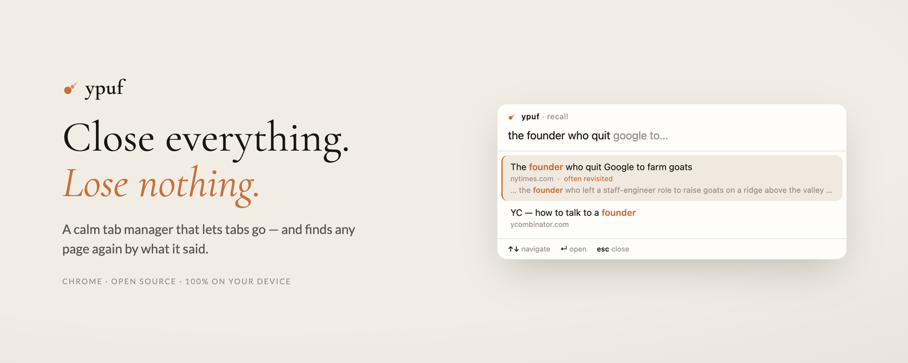
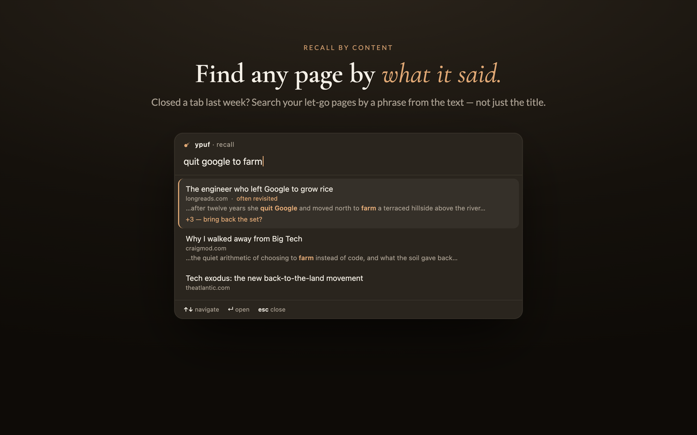
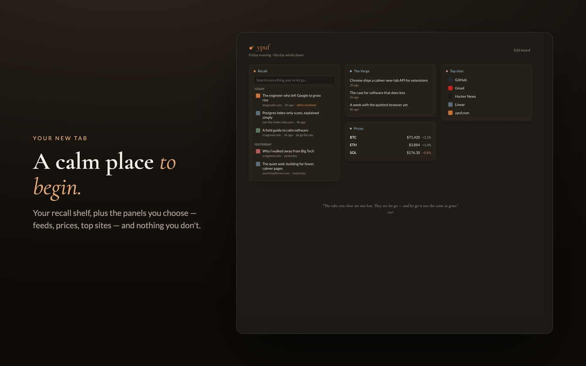
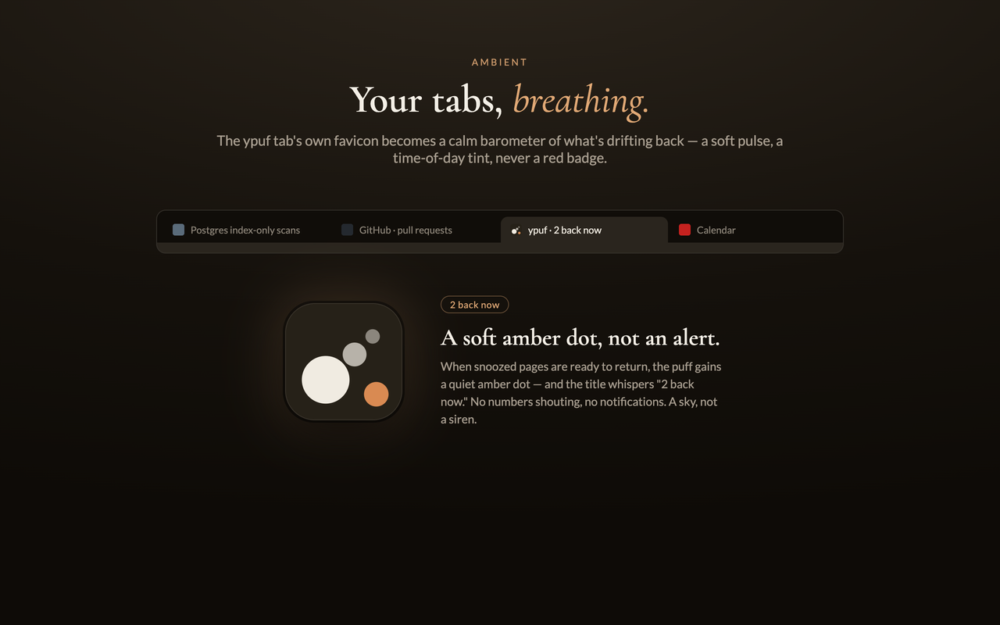
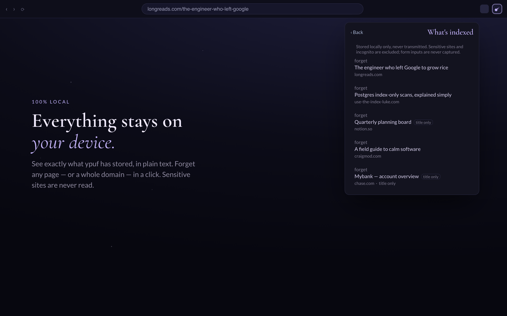

<div align="center">



# ypuf

**Your Pages, Unburdened & Findable.**

*Close the tabs you've stopped using — and find any page again by what it said.*

[](https://ypuf.com)
[](https://github.com/momentmaker/ypuf/actions/workflows/ci.yml)


[](LICENSE)

</div>

---

Tabs are open loops. ypuf treats them like one — let go of what's dead (the *ebb*),
recall what matters the moment you need it (the *flow*). It quietly clears the tabs
you've stopped caring about and gives you instant, full-text recall of everything
you've ever had open, so you can **close everything and lose nothing.**

Everything stays on your device. No servers, no accounts, no analytics — ever.

> The name is the sound: **puff**, a tab let go. *Ebb* is the in-app verb for it.

## See it

<table>
  <tr>
    <td width="50%"></td>
    <td width="50%"></td>
  </tr>
  <tr>
    <td width="50%"></td>
    <td width="50%"></td>
  </tr>
</table>

## What it does

- **Auto-let-go** — ypuf conservatively archives the tabs you've stopped using
  (open for days, never revisited, nothing unsaved). Tabs fade with a soft *puff*;
  the bar gets lighter. There's always an instant undo, it learns from what you
  reopen, and it never touches pinned tabs, audio, logins, forms, or sites you've
  protected.
- **Recall — the safety net** — every let-go page is indexed by its **content**
  (the readable article text, not just the title), on-device. Hit
  **`Ctrl/Cmd+Shift+K`** anywhere and search by what a page *said* — *"that article
  about the founder who quit Google to farm."* Faster than re-googling, with content
  snippets, recency grouping, and an "often revisited" marker.
- **Snooze a tab** — **`Ctrl/Cmd+Shift+S`** sends a tab away until *later today*,
  *this weekend*, *next week*, or *when you're back* — with a guaranteed return.
- **Bring back the set** — restore a page together with the working set of tabs it
  was open with ("resume my Tuesday tax research").
- **A calm new-tab board** — a quiet, glanceable panel board: ypuf's own recall
  shelf, plus optional panels (RSS, crypto prices, top sites). A full vim-style
  keyboard layer (`j`/`k`, `f`-hints, `/` search, `?` help).
- **The living-puff favicon** — the tab's own favicon and title become an ambient
  barometer of your snooze queue: a barely-there breath, a time-of-day tint, a soft
  amber dot when pages are ready to return. A sky, never a siren.
- **Light · dark · star** theming, with a live moon-phase toggle computed on-device.

## Privacy — load-bearing, not a footnote

Everything ypuf records lives on your machine. **Nothing leaves your device** — no
servers, no accounts, no analytics, nothing sold or shared. Page content is extracted
locally with Mozilla Readability and never transmitted. Incognito is never indexed;
banking / health / government / password-manager sites are excluded by default (and
the list is yours to extend); form inputs are never captured. You get a visible
**"what's indexed"** view and one-click **forget** for any page or domain.

The only network requests ypuf can make come from **optional panels you add yourself**
(an RSS feed, a price source) — each disclosed in its footer, each an ordinary fetch to
the source you picked. Add none and ypuf never touches the network. Full policy:
[`PRIVACY.md`](PRIVACY.md).

## Keyboard shortcuts

| Shortcut | Action |
|---|---|
| `Ctrl/Cmd+Shift+Y` | Open the ypuf shelf (popup) |
| `Ctrl/Cmd+Shift+K` | Recall command bar |
| `Ctrl/Cmd+Shift+L` | Let go of the current tab |
| `Ctrl/Cmd+Shift+S` | Snooze the current tab |

Remap any of these at `chrome://extensions/shortcuts`. The new-tab board adds a full
vim-style layer — press `?` there for the cheatsheet.

## Install

**Chrome Web Store** — *in review; a link lands here on approval.*

**From source (developer mode):**

1. Clone this repo.
2. Open `chrome://extensions`, enable **Developer mode**, click **Load unpacked**.
3. Select the [`extension/`](extension/) folder.

ypuf works with **no host permissions by default**. To turn on full-content recall,
open the popup and click **"turn on"** — Chrome asks for page access only in that
gesture (the optional `<all_urls>` grant).

## How it works

ypuf is **vanilla JavaScript with no build step** — what's in [`extension/`](extension/)
is exactly what ships. The architecture keeps a hard line between *decidable logic* and
*browser surfaces*:

- **Pure, node-tested core** — anything decidable (eligibility scoring, the blocklist,
  search ranking, the snooze return-window, the favicon barometer) lives in
  [`extension/lib/`](extension/lib/) as dependency-free modules, each with a sibling
  test in [`tests/`](tests/). They run under `node --test` with no DOM.
- **Thin browser surfaces** — the service worker, new-tab board, popup, and the
  injected recall/snooze command bars stay as thin as possible and render
  page-derived text with `textContent` only (never `innerHTML`) — page titles are
  attacker-influenced, so the text-only guarantee is the XSS boundary.
- **Local-only storage** — a content index in IndexedDB + settings in
  `chrome.storage.local`. Uninstalling deletes all of it.

## Development

```sh
npm install            # dev-only: fake-indexeddb for the tests (never shipped)
node --test tests/*.test.js
```

Then load [`extension/`](extension/) unpacked (see Install) and reload after edits.
Browser-only surfaces are verified by hand against
[`tests/MANUAL-DOGFOOD.md`](tests/MANUAL-DOGFOOD.md) and runtime-checked with a
stubbed-`chrome` HTML harness.

Product and architecture decisions live in [`docs/CONTEXT.md`](docs/CONTEXT.md);
documented learnings in [`docs/solutions/`](docs/solutions/).

## Releasing

Versioning is semver; the `version` in `extension/manifest.json` is the source of truth,
and [`CHANGELOG.md`](CHANGELOG.md) (Keep a Changelog) is the source for release notes.

```sh
./scripts/release.sh 1.0.1            # bump version + promote changelog + test + commit + tag
git push origin main --follow-tags    # …or pass --push to do it in one shot
```

Pushing a `vX.Y.Z` tag runs [`.github/workflows/release.yml`](.github/workflows/release.yml):
it re-runs the tests, builds the package with [`scripts/pack.sh`](scripts/pack.sh),
publishes a **GitHub Release** (your changelog section + an auto-generated commit list),
and pushes the new version live to the Chrome Web Store.

## Project structure

```
extension/         the shipped MV3 extension — load this unpacked
  background.js    service worker: let-go, recall, snooze, the auto-sweep
  newtab/          the new-tab board
  popup/           the toolbar shelf
  overlay/         injected recall + snooze command bars (closed shadow DOM)
  lib/             pure, node-tested modules — the decidable core
tests/             node --test suites for lib/
scripts/           pack.sh (build the store zip) · release.sh (cut a release)
docs/
  CONTEXT.md       every product + technical decision
  solutions/       documented learnings (patterns, bugs, conventions)
  store/           Chrome Web Store listing copy, assets, submission checklist
```

## Philosophy

ypuf's promise is **calm**. It's pull-only — no notifications, no badges, no numerals
shouting for attention. It does one thing (manage and recall your tabs) and refuses to
accrete into the cluttered thing it's meant to cure. Closing a tab should feel like
exhaling, not like losing something — so recall is *guaranteed*, and that guarantee is
what makes letting go easy.

## License & attribution

MIT © 2026 momentmaker — see [LICENSE](LICENSE).

The extension scaffold is adapted in part from
[tab-out](https://github.com/zarazhangrui/tab-out) (MIT © 2026 Zara Zhang); page-text
extraction uses [Readability](https://github.com/mozilla/readability) (Mozilla, Apache-2.0).
See [NOTICE.md](NOTICE.md).
