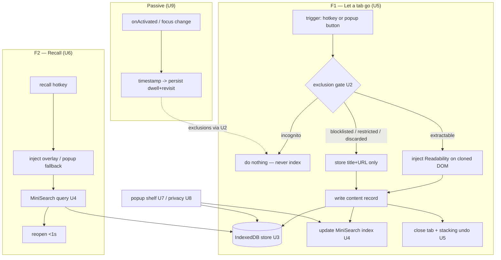
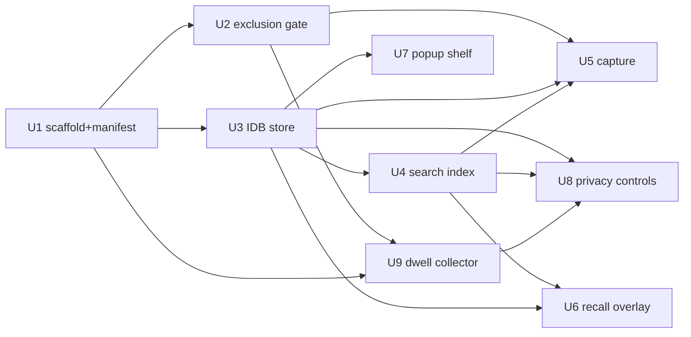

# feat: ypuf slice 1 — recall + archive shelf

## Summary

Build slice 1 of ypuf by treating the `reference/tab-out/` extension as a parts bin, not a base: rebuild the MV3 manifest (toolbar popup + remappable hotkeys + a content-script command-bar overlay, new-tab page left untouched) and lift only the self-contained helpers and `:root` design tokens with dual MIT attribution. The new work is a capture→index→recall pipeline — a service-worker exclusion gate built first, Readability injected at let-go, an IndexedDB content store, a vendored MiniSearch index, the popup shelf, the injected command bar, the privacy controls, and a silent dwell/revisit collector — sequenced into 9 dependency-ordered units across three phases.

---

## Problem Frame

ypuf's defensible core is full-content recall of pages the user lets go — "close everything, trust nothing important is lost." Slice 1 builds that safety net and moat first, before the auto-let-go hero (slice 2), so automation later ships safe-by-construction (see origin Problem Frame). The implementation challenge is that the reference extension provides none of this: `reference/tab-out/` is a new-tab dashboard with no popup, no hotkeys, no content extraction, no IndexedDB, and no privacy layer — so slice 1 is greenfield on top of an MV3 skeleton, on a privacy-sensitive surface (it indexes page content) with real MV3-lifecycle constraints (memory-saver tab discards, service-worker termination, restricted-page injection limits).

---

## Requirements

Traces to origin `docs/brainstorms/2026-06-14-ypuf-v1-sequence-and-slice1-requirements.md`.

**Foundation & capture**
- R1. Build on the tab-out MV3 scaffold, lifting deliberately with attribution per `NOTICE.md`.
- R2. Vanilla JS, no build step for the shipped extension.
- R3. Request only the permissions slice 1 needs; extraction is injected at let-go, not blanket continuous host access.
- R4. Let go of the active tab via at least one explicit trigger.
- R5. On let-go, extract readable article content (Readability), body text only, skipping nav/sidebars/form fields.
- R6. Capture only at let-go, never continuously; open tabs are never indexed.
- R7. Tab closes with a ~6s stacking undo; undo reopens and removes the index entry.

**Recall**
- R8. Global remappable hotkey opens a command-bar overlay; closes on Esc/backdrop/re-press; popup shows the binding.
- R9. Fuzzy search over title + URL + content; distinct empty states (nothing-indexed vs no-match).
- R10. Restore reopens in under one second; recall is non-destructive.

**Shelf & storage**
- R11. Toolbar popup shows a reverse-chron "recently let go" list with an invitational empty state.
- R12. Popup hosts the archive trigger and the privacy-control entry points.
- R13. New-tab page left untouched (reserved for slice 5).
- R20. Persist content in IndexedDB, local-only, never transmitted.
- R21. Retention cap / prune so the index can't grow unbounded.

**Privacy (load-bearing)**
- R14. Incognito never indexed — no capture at all.
- R15. Sensitive-domain blocklist (shipped + user-extensible) stored title+URL-only with query stripped; gate-then-extract ordering; retroactive purge on blocklist-add.
- R16. Never capture input/field values.
- R17. "What's indexed" view.
- R18. One-click forget (page = undo; domain = confirm).

**Signal**
- R19. Background dwell (foreground active-time) + revisit tracking, persisted, no UI, exclusions apply; consumed by nothing in slice 1.

**Origin actors:** A1 (tab-drowning knowledge worker — primary), A2 (Japanese learner — slice 5 only; constrains slice 1 not to squat on new-tab).
**Origin flows:** F1 (let a tab go / manual archive), F2 (recall something let go).
**Origin acceptance examples:** AE1 (covers R5, R6), AE2 (R14), AE3 (R15), AE4 (R10), AE5 (R7), AE6 (R18).

---

## Scope Boundaries

- **Auto-let-go (slice 2), snooze (slice 3), session clustering/restore (slice 4), flashcard/jivx widget (slice 5)** are out. Only *passive* signal collection (R19) lands now; nothing acts on it.
- **No continuous/proactive content capture.** Capture is at let-go only (R6). The research-suggested "pre-capture on visibilitychange to beat tab-discard" is explicitly rejected — it re-introduces the continuous-indexing model the brainstorm ruled out.
- **No new-tab dashboard / scan-and-prune surface** (origin §9 anti-pattern); new-tab untouched.
- **No runtime AI, no BYO-key, no local model.**
- **No cross-device sync.**
- **No "puff"/close-sound/confetti.** `playCloseSound` and `shootConfetti` are liftable from tab-out but parked for slice 2; manual let-go gets a plain undo toast.
- **No side-panel surface.** The command bar is a content-script overlay with a popup fallback on restricted pages.

### Deferred to Follow-Up Work

- **Right-click context-menu archive trigger** — slice 1 ships a hotkey + popup button; context menu is a later add.
- **Reload-then-extract for discarded tabs** — slice 1 falls back to title+URL-only; reload-to-recover is a possible later enhancement.
- **Path-scrubbing beyond query strings** for blocklisted URLs — slice 1 strips query strings; deeper path redaction is deferred (origin Outstanding Question).

---

## Context & Research

### Relevant Code and Patterns

- `reference/tab-out/extension/manifest.json` — MV3 baseline. **Adapt, don't copy:** drop `chrome_url_overrides.newtab`; add `action.default_popup`, `commands`, `scripting`, minimal host access, `web_accessible_resources`.
- `reference/tab-out/extension/app.js` — lift self-contained helpers (with dual-attribution headers): `friendlyDomain`/`FRIENDLY_DOMAINS`/`capitalize`, `cleanTitle`/`smartTitle`/`stripTitleNoise` (its email-stripping aids PII minimization), `timeAgo`, `showToast` (seed for the undo toast — must be extended to stack), the `ICONS` SVG map, and the delegated `data-action` click dispatcher. The save-for-later module is the right *shape* for the shelf but its `chrome.storage.local` backing and `.includes()` search are replaced by IndexedDB + MiniSearch.
- `reference/tab-out/extension/background.js` — reuse the listener-registration pattern and internal-URL filter; the badge logic is throwaway. No `onActivated`/`openerTabId` exists — the signal collector is greenfield.
- `reference/tab-out/extension/style.css` — lift the `:root` design tokens (warm-paper "calm" palette) and the toast/archive component styles; leave the dashboard/grid styles.
- `NOTICE.md` — binding: every file derived from tab-out keeps Zara Zhang's MIT notice alongside ypuf's.

### Institutional Learnings

- None — `docs/solutions/` does not exist (brand-new repo). Slice 1 is net-new institutional knowledge; a good `/ce-compound` candidate after it lands.

### External References

- Chrome `chrome.scripting.executeScript` awaits a Promise-returning injected function — extract then `await chrome.tabs.remove`. ISOLATED world, top frame only (no `allFrames`). Missing permission aborts the whole injection. ([scripting](https://developer.chrome.com/docs/extensions/reference/api/scripting))
- **Tab discard:** `tab.discarded` has no live DOM; Chrome fires **no discard event** and `pagehide`/`unload` don't fire on discard; common since Chrome 108 Memory Saver. → title+URL fallback at let-go. ([memory-saver](https://developer.chrome.com/blog/memory-and-energy-saver-mode))
- **Readability** `@mozilla/readability` 0.6.0, Apache-2.0, zero-dep, vendorable UMD. `parse()` mutates the DOM → run on `document.cloneNode(true)`. Gate with `isProbablyReaderable()`; `null` → lower `charThreshold` → manual selectors → title+URL floor. Returns `textContent` (what we index). ([readability](https://github.com/mozilla/readability))
- **Search: MiniSearch** (MIT, ~7 kB, zero-dep UMD) — inverted index, `fuzzy`+`prefix`+`boost`, `toJSON`/`loadJSON` snapshot persistence; ~50k-doc ceiling (well above target). IndexedDB is source of truth; MiniSearch is a rehydratable snapshot. ([minisearch](https://github.com/lucaong/minisearch))
- **SW lifecycle:** terminates ~30s idle; in-memory globals lost; register listeners synchronously at top level (the #1 footgun); compute dwell via timestamp-on-activate / persist-on-deactivate; `windows.onFocusChanged === -1` means Chrome unfocused. ([sw-lifecycle](https://developer.chrome.com/docs/extensions/develop/concepts/service-workers/lifecycle))
- **Storage:** `chrome.storage.local` is 10 MB (too small for content) → IndexedDB via `self.indexedDB`; reopen on SW wake; never `await` unrelated work mid-IDB-transaction.
- **Retention:** per-record indexed `lastAccessed` + `byteSize`; prune by age + LRU + byte-budget via `navigator.storage.estimate()` (~75%); `QuotaExceededError` backstop.
- **XSS:** the "what's indexed" view renders extracted text via `textContent`, never `innerHTML` (stored-content is attacker-controlled); keep MV3 default CSP. ([OWASP browser-ext](https://cheatsheetseries.owasp.org/cheatsheets/Browser_Extension_Vulnerabilities_Cheat_Sheet.html))

---

## Key Technical Decisions

- **tab-out is a parts bin.** Rebuild the manifest; lift only self-contained helpers + design tokens with dual MIT attribution; self-host fonts (tab-out's Google-Fonts CDN link violates the local-only promise).
- **Minimal permissions (R3).** Prefer `activeTab` + `scripting` (gesture-scoped injection on the active tab — let-go and recall are both user gestures) over broad `host_permissions: <all_urls>`. `tabs` for metadata (url/incognito/active), `storage`, `commands`. This keeps the install prompt non-scary and matches the privacy promise. **Gesture constraint:** `activeTab` grants host access only for the gesture's duration on the gesturing tab; without a gesture it yields no access and injection aborts. Slice 2's auto-let-go fires *without* a gesture and will therefore need scoped `host_permissions` — flagged now (Open Questions) so the jump is deliberate, not a reflexive `<all_urls>`.
- **Gate-then-extract.** The exclusion gate (incognito / blocklist / restricted-scheme) runs in the service worker *before* any content script is injected, so excluded page content never enters a capturable context.
- **Message-passing trust (SW-as-broker).** The service worker is the only trusted party: no `onMessageExternal` is ever defined; internal `onMessage` verifies `sender.id` and acts on `sender.tab`, never on a URL/id taken from the message body. The injected overlay and extractor are render/keystroke-only — every index read and every `chrome.tabs` create/remove happens in the SW, keyed to `sender.tab.id`. This blocks a malicious page from forging an archive command, dumping the index, or reading another origin's stored content (the single largest exploit surface).
- **Capture model.** At let-go: gate → if extractable, `scripting.executeScript` injects vendored Readability against a *cloned* DOM (top frame, isolated world), `isProbablyReaderable` gate, `charThreshold` fallback chain → write store + index → close tab → undo. Discarded/frozen/restricted tabs skip extraction and store **title+URL-only** (the guaranteed recall floor); no reload.
- **Storage split + crash-consistency.** IndexedDB = source-of-truth content records (indexed `host`, `lastAccessed`, `byteSize`). MiniSearch = in-memory index snapshotted to storage and rehydrated on startup; one write path keeps store and index in sync (IDB has no change hook). The snapshot persists *asynchronously*, so **IDB is authoritative**: on SW cold start, reconcile — diff IDB record ids against the rehydrated index and re-add any missing. This covers an SW death between the IDB write and the snapshot flush, which would otherwise leave a just-let-go page in the store but unsearchable.
- **Retention.** Age + LRU(`lastAccessed`) + byte-budget keyed off `navigator.storage.estimate()`, pruned proactively before large writes, `QuotaExceededError` backstop.
- **SW durability.** All `chrome.tabs`/`chrome.windows` listeners registered synchronously at top level; dwell computed from persisted timestamps (never in-memory counters); `chrome.storage.session` for hot ephemeral state, `chrome.storage.local`/IDB for durable. **Pending-undo state** (record id + expiry per stacked toast) is persisted to `chrome.storage.session` and reconstructed/expired on SW wake, so a termination inside the ~6s window can't orphan a record or lose the undo handle. Undo is a same-session convenience; **recall is the durable safety net** — the "nothing is lost" guarantee rests on recall, not undo.
- **XSS-safe rendering (all sinks).** Every page-derived string (`title`, `url`, `content`, `excerpt`) renders via `textContent`/DOM nodes — never `innerHTML` or template-string HTML — across *all four* sinks: the what's-indexed view, recall results incl. match-highlighting, popup shelf rows, and the undo toast. Reopen validates the stored URL is `http(s)` before `chrome.tabs.create` (no `javascript:`/`data:` schemes). Default MV3 CSP is a hard invariant: no `'unsafe-inline'`, no remote script, no `wasm-eval`; vendored libs load as `'self'` files, never `eval`'d from storage.
- **Cross-store privacy invariant.** Every forget / blocklist-purge / retention operation spans *all* persisted stores — the IndexedDB content records, the MiniSearch snapshot (re-snapshotted after any content removal), the dwell/revisit store, the user blocklist, and `chrome.storage.session` hot state. Adding a store is incomplete until the purge paths cover it; enforced as a tested post-condition, not prose.
- **Undo (R7).** Stacking toasts, ~6s, dismiss-on-click; most-recent on top; each reverses its own archive.
- **Testing posture.** Pure-logic modules get `node --test` (built-in, zero new runtime deps) with `fake-indexeddb` (reset to a fresh `IDBFactory` per test). The Chrome-touching code is made testable by **dependency injection** — message handlers, the dwell math, and the capture-pipeline transform take their `chrome` surface (or its outputs) as arguments, so they unit-test with hand-rolled `globalThis.chrome` stubs via `node:test` `mock.fn()`. Do **not** adopt `jest-chrome`/`sinon-chrome` (both stale/pre-MV3). `chrome.scripting.executeScript` is stubbed with canned Readability output to test normalize-and-persist; `navigator.storage.estimate()` is injected. Genuinely visual/injection surfaces (overlay layout, popup chrome, real in-page Readability extraction) stay on a scripted manual-dogfood checklist — `jsdom` can't model isolated-world content scripts or layout. A single Playwright load-extension smoke test (`let-go on a real tab → recall brings it back`) is deferred until slice 1 stabilizes. Caveat: `Intl.Segmenter` output skews Node-vs-Chrome — don't pin exact Japanese word-boundary assertions.

---

## Open Questions

### Resolved During Planning

- **Sub-second search mechanism (origin R10):** vendor MiniSearch over an IndexedDB source-of-truth.
- **Retention policy (origin R21):** age + LRU + byte-budget via `navigator.storage.estimate()`.
- **Archive triggers (origin R4):** ship a remappable `commands` hotkey + a popup button; context menu deferred.
- **Discarded-tab capture (origin premise call-out):** title+URL-only fallback; no reload.
- **Permission breadth (R3):** `activeTab` + `scripting`, not `<all_urls>`.
- **Testing strategy:** `node --test` + DI-based `chrome` stubs (`mock.fn()`) + `fake-indexeddb`; scripted manual-dogfood checklist for visual/injection surfaces; a single Playwright smoke test deferred until the slice stabilizes.
- **SW loading model:** classic worker + `importScripts` (matches vendored UMD); `lib/*.js` attach to a `ypuf` global.
- **Incognito:** manifest `"incognito": "not_allowed"`.
- **Crash-consistency:** IDB is authoritative; reconcile the index against the store on cold start; pending-undo persisted to `storage.session`; in-flight tab-id guard on let-go.
- **Restricted-page recall fallback:** open the popup (no inline notice).

### Deferred to Implementation

- **Slice-2 permission jump:** auto-let-go fires without a user gesture, so it cannot rely on `activeTab` and will need scoped `host_permissions` — a deliberate slice-2 decision flagged here, not a slice-1 task.

- Exact retention thresholds (byte-budget %, age cap) — tune against real dogfooding storage.
- Default sensitive-domain blocklist contents — seed list refined during U2.
- **UI detail resolved against real surfaces** (carried from the plan review): the what's-indexed view IA (entry point from the popup, list order, per-item vs per-domain forget surfacing); the popup shelf cap/scroll (max items + a "see all" path into the what's-indexed view); a visual distinction for title-only (`contentLess`) entries in the shelf + recall so a content-less recall doesn't read as a bug; the domain-forget inline confirmation copy.
- **Vendored-lib integrity:** record SHA-256 digests for `Readability.js` / `minisearch.min.js` (e.g. `vendor/CHECKSUMS.txt`) and verify before release.
- **`storage.session` access level** stays `TRUSTED_CONTEXTS` (assert in the SW-bootstrap test, never widened to untrusted).
- **Blocklist-add vs. in-flight capture:** re-gate at write time so a capture that lands just after a same-host blocklist-add is downgraded to title+URL-only.
- Exact MiniSearch tokenizer for mixed-language content (`Intl.Segmenter` for the future jivx/Japanese deck) — slice 1 can use the default; revisit if Japanese recall is poor. Note: `Intl.Segmenter` output skews Node-vs-Chrome, so don't pin exact word-boundary assertions in tests.

---

## Output Structure

    extension/
      manifest.json
      background.js              # service worker: listener wiring, exclusion gate host, dwell collector host
      lib/
        exclusion.js            # U2 gate: incognito / blocklist / restricted-scheme classifier
        store.js                # U3 IndexedDB content store + retention/prune
        search.js               # U4 MiniSearch index build/persist/sync
        capture.js              # U5 let-go pipeline (gate -> extract -> store -> close -> undo)
        signal.js               # U9 dwell/revisit collector (timestamp-based)
        attribution.js          # lifted tab-out helpers (dual MIT header): friendlyDomain, cleanTitle, timeAgo, ICONS
      popup/
        popup.html              # U7 shelf + U8 privacy controls entry
        popup.js
      overlay/
        overlay.js              # U6 injected command-bar overlay
        overlay.css
      vendor/
        Readability.js          # @mozilla/readability 0.6.0 (Apache-2.0 header preserved)
        minisearch.min.js       # MiniSearch UMD (MIT header preserved)
      style.css                 # :root tokens + components lifted from tab-out (dual MIT header)
      icons/                    # placeholder; real "puff" mark TBD
    tests/
      exclusion.test.js
      store.test.js
      search.test.js
      signal.test.js
      title-helpers.test.js     # capture.js pure-transform coverage folds into store/exclusion tests
      MANUAL-DOGFOOD.md         # scripted Chrome-API integration checklist

---

## High-Level Technical Design

> *This illustrates the intended approach and is directional guidance for review, not implementation specification. The implementing agent should treat it as context, not code to reproduce.*

Dependency order across units:

---

## Implementation Units

Three dependency phases: **Phase A — Foundation** (U1 scaffold, U2 gate, U3 store, U4 index); **Phase B — Core loop** (U5 capture, U6 recall, U7 popup shelf); **Phase C — Privacy surface + signal** (U9 dwell collector, then U8 privacy controls — U8 depends on U9's delete primitives).

### U1. Project scaffold + rebuilt manifest

**Goal:** A loadable MV3 extension skeleton with ypuf's manifest, an empty service worker, a stub popup, vendored libs in place, and dual-attribution headers — new-tab untouched.

**Requirements:** R1, R2, R3, R13

**Dependencies:** None

**Files:**
- Create: `extension/manifest.json`, `extension/background.js` (stub), `extension/popup/popup.html` (stub), `extension/popup/popup.js` (stub), `extension/style.css`, `extension/icons/` (placeholders), `extension/vendor/Readability.js`, `extension/vendor/minisearch.min.js`, `extension/lib/attribution.js`
- Test: `tests/title-helpers.test.js`

**Approach:**
- Manifest: `manifest_version: 3`; `action.default_popup`; `permissions: ["tabs","activeTab","scripting","storage"]`; `commands` with `_execute_action` plus a custom recall command (suggested key, remappable); **`"incognito": "not_allowed"`** (incognito tabs filtered at the manifest layer — defense-in-depth for R14, not single-gate reliance). **No `chrome_url_overrides`.** The overlay is injected **programmatically** via `scripting`/`insertCSS`, so its assets need not be web-accessible — **drop `web_accessible_resources`** (an unscoped one lets any page fingerprint that ypuf is installed). Default strict CSP retained as a hard invariant; fonts self-hosted.
- **Service-worker loading model:** classic worker (`background.service_worker`, no `type: module`) loading deps via `importScripts('vendor/minisearch.min.js', 'lib/exclusion.js', …)`; each `lib/*.js` attaches to a single `ypuf` namespace global. Matches the already-vendored UMD builds and keeps no-build wiring trivial — every `lib/*.js` is authored to this convention, not ES `export`.
- Lift `friendlyDomain`/`FRIENDLY_DOMAINS`/`capitalize`, `cleanTitle`/`smartTitle`/`stripTitleNoise`, `timeAgo`, `ICONS` into `extension/lib/attribution.js` with a dual MIT header (Zara Zhang + ypuf) per `NOTICE.md`. Self-host or system-font the typography (no external CDN).
- Vendor Readability and MiniSearch UMD builds with their license headers preserved.

**Patterns to follow:** `reference/tab-out/extension/manifest.json` (MV3 shape), `reference/tab-out/extension/app.js` (helper source), `NOTICE.md` (attribution).

**Test scenarios:**
- Happy path: `friendlyDomain("https://www.github.com/x")` → "GitHub"; `cleanTitle` strips a known site-name suffix.
- Edge case: `stripTitleNoise` removes an email address and a "(3)" notification count from a title.
- Edge case: `timeAgo` for now, minutes-ago, and days-ago inputs returns expected strings.

**Verification:** Loads unpacked in Chrome with no console errors; toolbar icon opens the stub popup; the new-tab page is the browser default (unchanged).

---

### U2. Privacy exclusion gate

**Goal:** A pure classifier that decides, for a given tab, whether it is `never-index` (incognito), `metadata-only` (blocklisted domain or restricted/uninjectable scheme), or `extractable` — the single entry point enforcing gate-then-extract.

**Requirements:** R3, R14, R15, R16

**Dependencies:** U1

**Files:**
- Create: `extension/lib/exclusion.js`
- Test: `tests/exclusion.test.js`

**Approach:**
- Input: `{url, incognito}`. Output: a classification enum + a normalized URL for storage (query stripped for blocklisted).
- Shipped default blocklist (banking/health/gov/password-manager domains) merged with a user-extensible list read from `chrome.storage.local`.
- Restricted-scheme detection: `chrome://`, `edge://`, `about:`, `view-source:`, `chrome-extension://`, `data:`/`blob:`, the Web Store host, the PDF viewer — classify `metadata-only` (can't inject).
- Field-value capture ban (R16) is enforced downstream by Readability's body-only extraction + never reading inputs; this module documents the invariant.

**Execution note:** Implement test-first — this is pure logic and load-bearing for privacy.

**Patterns to follow:** the internal-URL filter in `reference/tab-out/extension/background.js`.

**Test scenarios:**
- Covers AE2. Happy path: `{incognito: true}` → `never-index` regardless of URL.
- Covers AE3. Happy path: a blocklisted banking host → `metadata-only`, returned URL has query string stripped.
- Edge case: `chrome://settings` and a Web Store URL → `metadata-only` (uninjectable).
- Edge case: a normal `https://` article not on the blocklist → `extractable`.
- Edge case: a user-added blocklist domain (from storage) classifies `metadata-only`; removing it reverts to `extractable`.
- Error path: malformed/empty URL → `metadata-only` (fail closed, never `extractable`).

**Verification:** Every classification path is unit-tested; no input yields `extractable` for an incognito or blocklisted tab.

---

### U3. IndexedDB content store + retention

**Goal:** The local source-of-truth store for archived pages, with domain-indexed records and an age+LRU+byte-budget prune.

**Requirements:** R20, R21, R18 (delete primitives), R15 (retroactive purge primitive)

**Dependencies:** U1

**Files:**
- Create: `extension/lib/store.js`
- Test: `tests/store.test.js`

**Approach:**
- One object store of records `{id, url, host, title, content, excerpt, timestamp, lastAccessed, byteSize, contentLess}`; indexes on `host`, `lastAccessed`, `byteSize`, `timestamp`.
- CRUD: `put`, `get`, `listRecent`, `getByDomain`, `delete`, `deleteByDomain`, `touch` (bump `lastAccessed` on recall).
- `prune()`: estimate usage via `navigator.storage.estimate()`; when over the byte threshold, evict oldest-by-`lastAccessed` and beyond an age cap; wrap writes in `QuotaExceededError` try/catch with delete-then-retry.
- Reopen the DB on each SW wake; never `await` unrelated work inside a transaction.

**Execution note:** Test-first with `fake-indexeddb`.

**Test scenarios:**
- Happy path: put then get round-trips a record; `listRecent` returns reverse-chronological order.
- Happy path: `deleteByDomain(host)` removes every record for that host and leaves others.
- Edge case: `touch` updates `lastAccessed` and changes LRU prune order.
- Edge case: `prune()` over the byte budget evicts the least-recently-accessed first, not the oldest-created.
- Error path: a `QuotaExceededError` on put triggers prune-and-retry; a second failure surfaces an error rather than silently dropping.
- Integration: a `contentLess` (title+URL-only) record stores and lists like any other and is never given page content.

**Verification:** Store passes its unit suite under `fake-indexeddb`; prune keeps usage under the configured budget across a simulated overflow.

---

### U4. Search index (MiniSearch)

**Goal:** A fuzzy, sub-second search index over the store, kept in sync with writes/deletes and persisted/rehydrated across sessions.

**Requirements:** R9, R10

**Dependencies:** U3

**Files:**
- Create: `extension/lib/search.js`
- Modify: `extension/lib/store.js` (route writes/deletes through a single index-updating path)
- Test: `tests/search.test.js`

**Approach:**
- MiniSearch over `title`, `url`, `content`; `boost` title > url > content; `fuzzy` + `prefix` enabled.
- Persist via `toJSON()` into storage with the field config beside it; `loadJSON()` on startup wrapped in try/catch — **any** failure (missing, malformed, or version-incompatible) triggers a full rebuild from the store. After a successful load, **reconcile** against IDB (re-add any record ids present in the store but absent from the index) so an async-snapshot gap can't hide a record.
- `add`/`replace`/`discard` mirror every store mutation so index and store never drift.

**Execution note:** Test-first for query behavior and persistence round-trip.

**Test scenarios:**
- Covers AE4. Happy path: indexing a record then querying a phrase from its `content` returns it.
- Happy path: a `title` match outranks a `content`-only match for the same query (boost).
- Edge case: a fuzzy/typo query still matches; a prefix query matches mid-type.
- Edge case: `toJSON` → `loadJSON` round-trip reproduces identical query results.
- Edge case: removing a record from the store drops it from search results.
- Error path: a missing/incompatible snapshot triggers a full rebuild from the store rather than empty results.

**Verification:** Query latency is well under the <1s bar for a seeded corpus of a few thousand records; index and store stay consistent across add/remove.

---

### U5. Capture pipeline (let-go / F1)

**Goal:** The manual let-go flow end to end: trigger → gate → extract-or-fallback → write store+index → close tab → stacking undo.

**Requirements:** R4, R5, R6, R7

**Dependencies:** U2, U3, U4

**Files:**
- Create: `extension/lib/capture.js`
- Modify: `extension/background.js` (command + message handling), `extension/popup/popup.js` (archive button wiring)
- Test: `tests/MANUAL-DOGFOOD.md` (Chrome-API integration), plus pure-helper coverage folded into `tests/exclusion.test.js`/`tests/store.test.js`

**Approach:**
- Triggers (R4): a `commands` hotkey and the popup archive button, both acting on the active tab (`activeTab` gesture grants injection).
- Pipeline: gate (U2) → if `extractable`, `scripting.executeScript` injects `vendor/Readability.js` + an extractor that clones the document, runs `isProbablyReaderable` then `Readability.parse()` on the clone, returns `{title, textContent, excerpt}`; on `null`, retry with a lowered `charThreshold`, then manual selectors, then fall back to title+URL-only. `metadata-only`/discarded/frozen tabs skip injection entirely and store title+URL-only.
- An **in-flight guard keyed by tab id** rejects a second let-go for a tab already being captured (prevents the hotkey + popup button from double-extracting, double-writing, or calling `remove` on an already-closing tab).
- After write (U3+U4), `chrome.tabs.remove`, then show a stacking undo toast. Each toast carries its **own** ~6s timer, shows `Let go: {cleanTitle}`, and **click-the-body = undo** (a separate × dismisses without undoing); most-recent on top. Undo reopens the tab (`chrome.tabs.create`) and deletes its record + index entry. Pending-undo entries persist to `chrome.storage.session` (see SW-durability decision) so a worker restart doesn't orphan them.

**Execution note:** Start from a manual integration check that lets go of a real article tab and recalls it, before hardening edge branches.

**Patterns to follow:** `reference/tab-out/extension/app.js` `saveTabForLater`/`showToast` (shape and toast seed; storage + stacking are new).

**Test scenarios:**
- Covers AE1. Integration: letting go of a normal article tab stores the article body (not nav/forms) and closes the tab; a tab merely left open is never indexed (R6).
- Covers AE5. Integration: undo within ~6s reopens the tab and removes the index entry; after expiry the entry persists and is recall-only.
- Edge case: letting go of a discarded/frozen tab stores title+URL-only and still closes.
- Edge case: letting go of a `chrome://` or PDF tab stores title+URL-only (no injection attempted).
- Edge case: two rapid let-gos produce two stacked undo toasts, each reversing its own archive.
- Edge case: a second let-go of the **same** tab fired before the first completes is ignored by the in-flight guard — exactly one record, one close.
- Integration: a record written but with the index snapshot not yet flushed becomes searchable after a simulated SW restart (reconcile re-adds it).
- Integration: a pending undo survives a simulated SW termination — on wake it is still resolvable or cleanly expired; the record is never orphaned.
- Error path: an extraction that throws or times out falls back to title+URL-only rather than blocking the close.

**Verification:** Manual dogfood checklist passes for article / discarded / restricted / rapid-stack cases; no path leaves a tab open-but-unindexed or closed-but-unrecoverable within the undo window.

---

### U6. Recall command bar (F2)

**Goal:** A hotkey-invoked overlay that fuzzy-searches and reopens a let-go page in under a second, with two empty states and clean dismissal.

**Requirements:** R8, R9, R10

**Dependencies:** U3, U4

**Files:**
- Create: `extension/overlay/overlay.js`, `extension/overlay/overlay.css`
- Modify: `extension/background.js` (recall command → inject overlay; restricted-page fallback)
- Test: `tests/MANUAL-DOGFOOD.md`

**Approach:**
- Recall `commands` hotkey programmatically injects the overlay on the active page (isolated world); on a restricted page where injection fails, fall back to opening the popup.
- The overlay is **render/keystroke-only**: it sends the query to the SW and renders returned results with `textContent` (match-highlighting built from DOM nodes, never `innerHTML`). The **SW** runs the MiniSearch query (U4) and performs the reopen — `chrome.tabs.create` only after validating the stored URL is `http(s)` (else focus the tab if still open, lifting tab-out's `focusTab` match logic) — then `touch`es `lastAccessed`. No index read or `tabs` mutation happens in page context (see Message-passing trust decision).
- On open the search input takes focus; **↑/↓ move through results, Enter opens the focused result, Esc/backdrop-click/re-press close**; on close, focus returns to the page element that held it. Two empty states (R9): nothing-indexed-yet (invite first let-go) vs no-match. Recall is non-destructive (entry remains). On a restricted page where injection fails, the fallback **opens the popup** (no inline notice) — resolving the prior deferred question.

**Patterns to follow:** `reference/tab-out/extension/app.js` `focusTab` (jump-if-open half), the `data-action` delegated-click dispatcher.

**Test scenarios:**
- Covers AE4. Integration: hotkey → type a body-text phrase → matching result → reopens in under a second.
- Happy path: selecting a result whose tab is still open focuses it instead of duplicating.
- Edge case: empty index shows the "nothing indexed yet" state; a non-matching query on a non-empty index shows the distinct "no match" state.
- Edge case: Esc, backdrop-click, and re-press all dismiss the overlay; a restored entry still exists afterward (non-destructive).
- Edge case: invoking recall on a `chrome://`/restricted page opens the popup fallback instead of failing silently.
- Edge case (XSS): a result whose title or excerpt contains an HTML/script payload renders as inert text (including match-highlighting); reopening an entry whose stored URL is a non-`http(s)` scheme is refused.

**Verification:** Manual dogfood confirms sub-second restore **measured cold (SW terminated): wake → IDB reopen → `loadJSON` rehydrate → first result**, not just warm query latency, on a seeded corpus; plus correct empty-state / keyboard-nav / dismissal / popup-fallback behavior; the SW is the only party that reads the index or mutates tabs.

---

### U7. Toolbar popup shelf

**Goal:** The popup surface showing the reverse-chron "recently let go" list, the archive trigger, and entry points to the privacy controls — with an invitational empty state.

**Requirements:** R8 (shows current hotkey binding), R11, R12

**Dependencies:** U3

**Files:**
- Modify: `extension/popup/popup.html`, `extension/popup/popup.js`, `extension/style.css`
- Test: `tests/MANUAL-DOGFOOD.md`

**Approach:**
- Render `listRecent()` (U3) as a reverse-chron list using lifted render scaffolding + `:root` tokens; each row reopens on click (reuse U6's reopen path).
- Archive-this-tab button (U5 trigger); surface the current recall hotkey binding (R8) with a link to `chrome://extensions/shortcuts`.
- Empty state invites the first let-go rather than a blank panel (R11).

**Patterns to follow:** `reference/tab-out/extension/app.js` deferred-column/archive render + `index.html` markup (re-homed from new-tab into the popup); `style.css` toast/archive component styles.

**Test scenarios:**
- Happy path: after letting go of two tabs, the popup lists them most-recent-first; clicking one reopens it.
- Edge case: first-run (no archives) shows the invitational empty state, and the archive button is still present and actionable.
- Edge case: the popup displays the current recall hotkey; remapping it at `chrome://extensions/shortcuts` is reflected on reopen.
- Edge case (XSS): a let-go page whose title contains an HTML/script payload renders as inert text in its shelf row — the lifted tab-out render scaffolding is audited so titles never reach `innerHTML`/template-string HTML.

**Verification:** Manual dogfood confirms the list, empty state, archive button, and binding display; new-tab page remains untouched.

---

### U8. Privacy controls — what's-indexed + forget + blocklist

**Goal:** The legibility/purge surface: see what's stored, forget a page or domain, manage the blocklist, and retroactively purge on blocklist-add.

**Requirements:** R15 (retroactive purge + blocklist edit), R17, R18

**Dependencies:** U3, U4, U9

**Files:**
- Modify: `extension/popup/popup.html`, `extension/popup/popup.js`
- Create: `extension/lib/blocklist.js` (user blocklist read/write + retroactive-purge orchestration)
- Test: `tests/MANUAL-DOGFOOD.md` (UI), `tests/store.test.js` (purge logic)

**Approach:**
- "What's indexed" view (R17) lists records (rendered via `textContent`), with per-record forget.
- Forget (R18): single-page = one click; the row is struck-through for a ~6s undo window and **undo restores all stores** (content + index + dwell), matching the cross-store invariant. Domain = an **inline** confirmation (`window.confirm()` is unavailable in popups) showing the entry count, then `deleteByDomain` (U3) + drop from index (U4) + dwell purge (U9).
- Adding a domain to the blocklist (U2's user list) triggers a **cross-store** retroactive purge: downgrade existing records to title+URL-only (strip content), **re-snapshot the MiniSearch index**, and **wipe the domain's dwell/revisit signal** via U9's delete primitive. Forget follows the same cross-store rule (content + snapshot + dwell).

**Test scenarios:**
- Covers AE6. Integration: clicking forget on a domain in the what's-indexed view removes every entry for that domain.
- Happy path: single-page forget removes one record and offers undo; the view updates.
- Edge case: domain forget requires confirmation; cancelling leaves records intact.
- Edge case: adding a domain to the blocklist purges its already-indexed content to title+URL-only (content gone, entry still recallable).
- Edge case (XSS): a record whose extracted text contains an HTML/script payload renders as inert text in the what's-indexed view (no execution).
- Integration (cross-store): domain forget also removes that domain's dwell/revisit signal (U9); blocklist-add purges both content and prior dwell signal and re-writes the MiniSearch snapshot; no stripped content survives in the on-disk snapshot.
- Edge case: metadata-only (blocklisted, title+URL) entries appear in the what's-indexed view and are individually forgettable.

**Verification:** Purge logic unit-tested as a post-condition across all stores; manual dogfood confirms forget/confirm/retroactive-purge flows and inert rendering.

---

### U9. Passive dwell/revisit signal collector

**Goal:** A silent background collector that accumulates foreground active-time and revisit counts per page, persisted across service-worker termination, respecting the same exclusions — feeding nothing in slice 1.

**Requirements:** R19

**Dependencies:** U1, U2

**Files:**
- Create: `extension/lib/signal.js`
- Modify: `extension/background.js` (top-level synchronous listener registration)
- Test: `tests/signal.test.js`

**Approach:**
- Register `chrome.tabs.onActivated`/`onUpdated` and `chrome.windows.onFocusChanged` synchronously at top level.
- Dwell: on activate/focus-in record a `focusStart` timestamp (`chrome.storage.session`); on deactivate/focus-out (or `onFocusChanged === -1`) compute the delta and add to the page's persisted dwell total (`chrome.storage.local`). Revisit: increment a per-URL re-activation counter.
- **Gate before write:** on activate/focus-in, run U2's classifier *before* persisting anything — `never-index` (incognito) and `metadata-only` (blocklist) both yield **zero persisted signal** (no `focusStart`, no key), so incognito browsing never reaches `chrome.storage.local`/disk. Expose `deleteByUrl`/`deleteByDomain` primitives on the signal store so U8's forget/purge can reach it. No UI, no slice-1 consumer.

**Execution note:** Test-first for the timestamp-delta math (the pure part); listener wiring verified via dogfood.

**Test scenarios:**
- Happy path: activate→(elapsed)→deactivate adds the correct delta to the page's dwell total.
- Edge case: a simulated SW termination between activate and deactivate (timestamp read back from storage) still produces the correct accumulated dwell — no reliance on in-memory state.
- Edge case: `onFocusChanged === -1` (Chrome unfocused) pauses accumulation; refocus resumes.
- Edge case: re-activating the same URL increments its revisit count; distinct URLs track independently.
- Edge case: an incognito/blocklisted tab writes **no key whatsoever** to storage (not merely a zero total); split- vs spanning-incognito storage visibility is covered.
- Integration: `deleteByDomain` on the signal store removes all of a domain's dwell/revisit records (exercised by U8's purge).

**Verification:** Dwell math passes unit tests (DI-stubbed `chrome`) including the termination case; no slice-1 surface reads the data (confirmed by absence of any consumer); no incognito-derived key ever lands in storage.

---

## System-Wide Impact

- **Interaction graph:** the service worker hosts the exclusion gate, capture orchestration, recall-command injection, and the dwell listeners; content scripts are injected on-gesture (capture extractor, recall overlay); the popup reads the store and hosts privacy controls. The SW is the sole trusted broker — injected content scripts are render/keystroke-only and never read the index or mutate tabs directly. New-tab is deliberately not in the graph (R13).
- **Error propagation:** extraction failures degrade to title+URL-only, never block the tab close; injection-blocked recall degrades to the popup fallback; store quota errors trigger prune-and-retry then surface.
- **State lifecycle risks:** the undo window (record written but reversible), store↔index sync (single write path), retention prune (LRU/byte-budget), and SW-termination-safe dwell accumulation are the four stateful hotspots.
- **API surface parity:** none external — fully local extension; nothing is transmitted.
- **Integration coverage:** capture end-to-end, overlay injection + restricted-page fallback, and SW-termination dwell are the cross-layer behaviors unit tests can't fully prove — covered by the manual dogfood checklist.
- **Unchanged invariants:** the browser's own new-tab page and history are untouched; the extension adds a local index, not a data processor.

---

## Risks & Dependencies

| Risk | Mitigation |
|------|------------|
| Discarded/crashed tabs leave no live DOM → recall gap | title+URL-only floor at let-go keeps the entry recallable; slice 2 inherits the same path. Honest "recall of everything let go." |
| Service-worker termination drops in-flight dwell | Timestamp-on-activate / persist-on-deactivate; no in-memory counters; listeners registered top-level synchronously. |
| Store and MiniSearch index drift | All mutations routed through one index-updating write path; snapshot rebuild on incompatible/missing index. |
| Empty net during slice-1 dogfooding (hoarders rarely archive) | Tracked as an explicit product risk (origin Open Questions); the dwell collector still banks browsing data regardless of archive volume. Not a build blocker; revisit before slice 2 relies on "safe by construction." |
| Overlay can't render on restricted pages | Detect uninjectable schemes; fall back to the popup. |
| Storage bloat from full-content index | Age + LRU + byte-budget prune via `navigator.storage.estimate()`. |
| Stored-content XSS across render sinks (what's-indexed, recall snippets/highlight, popup rows, undo toast) | `textContent`/DOM-node rendering for every page-derived string; reopen validates `http(s)`; default CSP locked (no inline/remote/eval). |
| Permission scariness undermining trust | `activeTab` + `scripting` (gesture-scoped) instead of `<all_urls>`. |
| Readability poor on SPAs / thin pages | Run on the hydrated live DOM (content script); `charThreshold` fallback chain → title+URL floor so there's never a hole. |
| Malicious page forges messages to the SW → archive command, index exfiltration, or cross-origin content read | No `onMessageExternal`; SW verifies `sender.id`/`sender.tab`; overlay is render-only; all index reads + `tabs` mutations run in the SW keyed to `sender.tab.id`, never message-body URLs/ids. |
| `web_accessible_resources` exposes overlay assets → install fingerprinting | Inject the overlay programmatically via `scripting`; drop `web_accessible_resources` entirely. |
| Forget/purge misses the separately-stored dwell signal or leaves a stale index snapshot | Cross-store purge invariant spanning content, MiniSearch snapshot, dwell, blocklist, session — tested as a post-condition; U9 exposes delete primitives. |
| Incognito/blocklisted dwell persisted to disk (R14/R15 leak) | U9 runs the U2 gate before any write; incognito + metadata-only → zero persisted signal; deliberate manifest `incognito` mode. |
| Content index unencrypted at rest → readable via local filesystem access | Stated v1 limitation (OS account + disk encryption are the protection); aggressive retention cap shrinks blast radius; passphrase encryption deferred. |
| `activeTab` injection silently aborts without a gesture | All slice-1 triggers gesture-backed; injection-no-result falls to the title+URL floor, not silent failure; slice 2's non-gesture path is a deliberate `host_permissions` decision flagged in Open Questions. |
| Title/path PII on blocklisted (metadata-only) entries | Known residual (query stripped, path deferred); entries appear in the what's-indexed view for manual forget; revisit path-scrubbing before any non-local feature. |

**Dependencies:** vendored `@mozilla/readability` 0.6.0 (Apache-2.0) and MiniSearch (MIT); `fake-indexeddb` as a dev-only test dependency (not shipped).

---

## Documentation / Operational Notes

- Every file derived from `reference/tab-out/` carries a dual MIT attribution header (Zara Zhang + ypuf) per `NOTICE.md`; `reference/` stays gitignored.
- Vendored libs keep their upstream license headers (Apache-2.0 for Readability, MIT for MiniSearch).
- Dogfood by loading `extension/` unpacked at `chrome://extensions`; reload after edits (no build step).
- **Unencrypted at rest:** stored content lives in IndexedDB in the Chrome profile, unencrypted — protected by the OS account + disk encryption, not by ypuf; it is as sensitive as browser history. State this in user-facing privacy copy; passphrase encryption is out of v1 scope, and an aggressive default retention cap shrinks the blast radius.
- **CSP / font invariant:** retain the default MV3 CSP (no `'unsafe-inline'`, no remote script, no `wasm-eval`); self-host fonts — tab-out's Google-Fonts CDN link is dropped (it violates local-only and would require loosening `style-src`). `chrome.storage.session` stays `TRUSTED_CONTEXTS` (never widened to untrusted, which would expose it to content scripts).
- Good `/ce-compound` candidate after landing — MV3 lifecycle, archive-time extraction, and load-bearing privacy are net-new institutional knowledge for this repo.

---

## Sources & References

- **Origin document:** [docs/brainstorms/2026-06-14-ypuf-v1-sequence-and-slice1-requirements.md](docs/brainstorms/2026-06-14-ypuf-v1-sequence-and-slice1-requirements.md)
- Product context: `docs/CONTEXT.md`; attribution rules: `NOTICE.md`
- Reference extension: `reference/tab-out/extension/` (gitignored)
- Chrome: [scripting](https://developer.chrome.com/docs/extensions/reference/api/scripting), [tabs](https://developer.chrome.com/docs/extensions/reference/api/tabs), [commands](https://developer.chrome.com/docs/extensions/reference/api/commands), [storage](https://developer.chrome.com/docs/extensions/reference/api/storage), [SW lifecycle](https://developer.chrome.com/docs/extensions/develop/concepts/service-workers/lifecycle), [Memory Saver](https://developer.chrome.com/blog/memory-and-energy-saver-mode)
- Libraries: [mozilla/readability](https://github.com/mozilla/readability), [MiniSearch](https://github.com/lucaong/minisearch)
- Security: [OWASP Browser Extension Vulnerabilities](https://cheatsheetseries.owasp.org/cheatsheets/Browser_Extension_Vulnerabilities_Cheat_Sheet.html)
