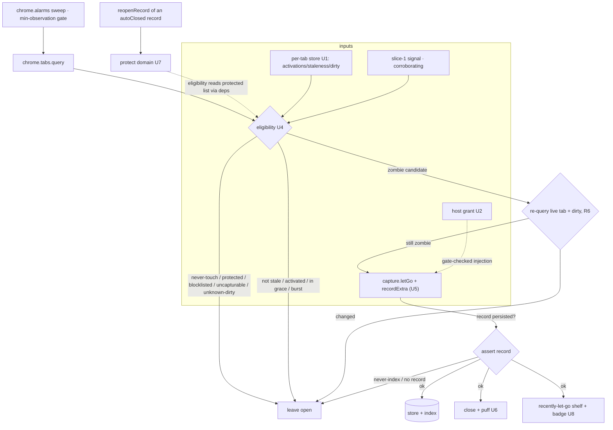
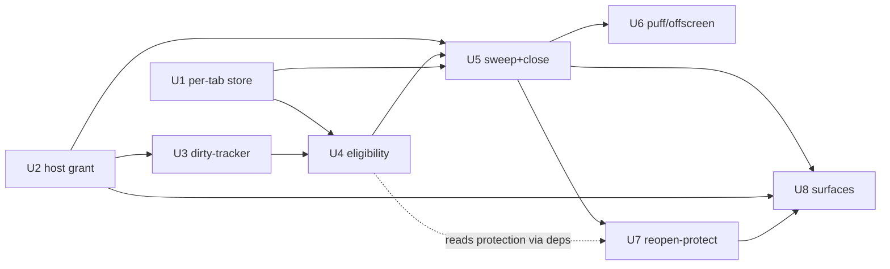

# feat: ypuf slice 2 — auto-let-go (the hero)

## Summary

Build auto-let-go by adding a thin **eligibility + sweep** layer on top of slice 1 rather than a new pipeline. `capture.letGo` is reused for the close (one additive optional `recordExtra` param), driven by a periodic `chrome.alarms` sweep via the existing `buildDeps()`; the genuinely new logic is the eligibility gate that decides *which* tabs reach it — gated on a URL-stable per-tab engagement signal, with hard "never close without a persisted record" and fail-safe invariants. v1 ships the conservative core — silently close only signal-gated zombies, learn one signal (reopen-protection), with calm passive reversal plus an ambient "it's on" surface. New pure DI modules (a per-tab state store, the zombie classifier, reopen-protection), a gate-checked dirty-tracker content script, an offscreen document for the puff, a privacy-aligned `optional_host_permissions` grant, and the popup enable control + three read surfaces. The gray-zone shadow/promotion learning system is out of scope (origin).

---

## Problem Frame

Slice 1 built the safety net (recall) and banked the signal (dwell/revisit per URL). The felt magic only arrives when ypuf lets tabs go *for* you — which is also the product's #1 risk: one wrong auto-close loses the user forever (origin Problem Frame; CONTEXT §14). The brainstorm review hardened this slice into a conservative core with hard safety invariants; this plan turns those into buildable units, leaning on slice 1's pipeline and the MV3 patterns already captured in `docs/solutions/architecture-patterns/mv3-local-content-indexing-extension-2026-06-14.md`.

---

## Requirements

Traces to origin `docs/brainstorms/2026-06-15-ypuf-slice2-auto-let-go-requirements.md`.

**Eligibility** — R1 (per-tab staleness + grace floor), R2 (signal-gated ultra-safe tier), R3 (restored-session/bulk-open exclusion), R4 (importance weighting from slice-1 signal).
**Never-touch** — R5 (audio/unsaved-input/pinned/recently-active/protected-domain/blocklist), R6 (re-evaluate before close), R7 (fail safe on uncertainty).
**Auto-close + safety invariants** — R8 (silent), R9 (capture-then-close; zombies recall by title+URL navigability), R10 (never close a tab whose capture didn't persist; blocklisted = never-auto-closed), R11 (privacy gate before injection), R12 (the puff, re-seated for the background case).
**Reversal/relief/discoverability** — R13 (popup recently-let-go = passive undo, no per-close toast; auto-closed items labeled), R14 (reopen-protection; protected domains visible + removable + purgeable), R15 (end-of-session relief, "N let go — all in your recall list"), R16 (ambient on/working surface).
**Permissions** — R17 (scoped non-`<all_urls>` host access; blocklist gates injection in code).

**Origin actors:** A1 (tab-drowning knowledge worker).
**Origin flows:** F1 (auto-let-go a zombie), F2 (learn from a reopen).
**Origin acceptance examples:** AE1 (R2/R5/R6/R7/R8/R9/R10/R12), AE2 (R5/R7), AE3 (R3), AE4 (R10/R11), AE5 (R14/R13), AE6 (R1), AE7 (R8/R13/R15), AE8 (R9).

---

## Scope Boundaries

- **Gray-zone shadow/promotion learning system** — deferred (origin): its correctness conditions are unknown pre-dogfooding and silent close corrupts its signal. v1 ships ultra-safe auto-close + reopen-protection; the gray zone is simply *not auto-closed*.
- **Mid-flow login/checkout detection** — v2 hardening; v1 uses mechanically-detectable never-touch guards + the fail-safe.
- **URL path-pattern learning** — v2; v1 learns per domain.
- **Pre-capture-before-discard / reload-then-extract for full-content zombie recall** — rejected for v1 (keeps slice 1's no-continuous-capture model; auto-closed zombies recall by title+URL navigability).
- **Cross-device sync**, a standalone learning dashboard, propose-then-confirm prompts, session clustering (slice 4), the flashcard widget (slice 5) — out.

### Deferred to Follow-Up Work

- Concrete threshold tuning (staleness window, dwell floor, alarm period, burst-detection window) lands during dogfooding, not as separate units.

---

## Context & Research

### Relevant Code and Patterns

- `extension/lib/capture.js` — `letGo(tab, deps)` is **gesture-agnostic** but has two facts the plan must respect: (a) it builds the record via `buildRecord`/`buildFloorRecord` with **no caller hook** to set extra fields, and (b) its `never-index` branch closes the tab *without* `store.put`. So auto-let-go threads an optional `recordExtra` param (to stamp `autoClosed:true` inside the one pre-close `store.put`) and excludes `never-index`/`metadata-only` from the auto path. **R10 lives in the caller** + the assert-record check (see Key Decisions); the manual floor-then-close contract is unchanged.
- `extension/lib/signal.js` — per-URL `{dwell, revisits}` in `chrome.storage.local` `signal`, keyed on the exact `tab.url` href and written **only for `extractable` URLs** (blocklisted/incognito pages get no key). Two consequences: a tab whose engagement was recorded under a *previous* URL reads as zero-signal (→ the URL-drift hole; engagement axis must be the per-tab `activations` count, see Key Decisions), and a metadata-only page has zero signal by construction (handled by excluding non-capturable tabs). Used only as a *corroborating* signal for R2/R4.
- `extension/lib/exclusion.js` — `classify`/`isInjectable`/`isWebUrl`. **`isInjectable` gates only on scheme, not the blocklist** — so the dirty-tracker/auto-capture injection path must call `classify` (not just `isInjectable`) and skip `never-index`/`metadata-only` (R11). Reused verbatim otherwise.
- `extension/lib/blocklist.js` — exports `ypuf.privacy`; owns the cross-store forget/purge inventory (`forgetDomain`, `forgetPage`, `retroactivePurge`). Slice 2 adds the protection, per-tab, and dirty stores to this inventory.
- `extension/background.js` — `buildDeps()`, `getActiveTab()`, the message router (verifies `sender.id === chrome.runtime.id`), `applyForeground`/`applyBlur` (signal listeners on `tabs.onActivated`/`onUpdated`/`windows.onFocusChanged`), `reopenRecord` (recall-open, the protection hook point), `maybePrune`, the in-memory `inFlight` Set, top-level synchronous listener registration. Hook points: an `alarms` sweep, extended tab listeners for last-activated/open-time/activations, the offscreen trigger, the reopen-protection hook, the badge.
- `extension/lib/store.js` / `search.js` — the recall net; auto-closed records flow through `letGo`→`store.put`→`search.addRecord`. `search.reconcile` is **bidirectional** but runs **only inside `initIndex` (cold start)** — it does not heal ghosts created mid-session, and auto-close churns far more remove/undo sequences than slice 1, so the plan adds an opportunistic reconcile (see U5). A record field like `autoClosed:true` is additive (no migration).
- `extension/popup/` — reuse the shelf as the undo surface; build new surfaces copying the "what's-indexed/forget" pattern.
- `tests/` — `node --test` + `fake-indexeddb/auto` + hand-rolled DI stubs (`makeDeps()` in `tests/capture.test.js` is the canonical shape).

### Institutional Learnings

- `docs/solutions/architecture-patterns/mv3-local-content-indexing-extension-2026-06-14.md` — carry forward verbatim: timestamp-persisted state (the per-tab staleness store must be timestamp-derived, like the dwell signal, or it resets on SW restart); gate-then-extract; **bidirectional reconcile**; record-undo-before-destructive-action (even more load-bearing for a non-human-in-loop close); always-answer-async-onMessage; DI testing. The offscreen "puff" audio is a **new seam** not covered there — a `/ce-compound` candidate after this slice.

### External References

- **`chrome.offscreen`** (Chrome 109+): `createDocument({reasons:['AUDIO_PLAYBACK'], justification})`; **one offscreen doc max** (reuse + serialize); detect-before-create via `chrome.runtime.getContexts` (116+); `AUDIO_PLAYBACK` auto-closes the doc ~30s after last sound (no manual lifecycle needed); SW→offscreen via `chrome.runtime.sendMessage` with a `target:'offscreen'` discriminator. ([offscreen](https://developer.chrome.com/docs/extensions/reference/api/offscreen))
- **`chrome.alarms`**: min period **0.5 min (30s)**, best-effort timing; `persistAcrossSessions` is **not dependable** — re-create the alarm on `onStartup`/`onInstalled`. ([alarms](https://developer.chrome.com/docs/extensions/reference/api/alarms))
- **Tab state**: `audible`, `discarded` (no DOM), `frozen` (**keeps DOM** ≠ discarded), `pinned`, `autoDiscardable`, `mutedInfo` — all on `tabs.onUpdated` `changeInfo`, readable without `tabs` permission. ([tabs](https://developer.chrome.com/docs/extensions/reference/api/tabs))
- **Restored session**: no direct event. Synthesize from `runtime.onStartup` + a post-startup grace window + a dense `onCreated` burst with absent `openerTabId`.
- **`host_permissions` for non-gesture injection**: `activeTab` can't do it (needs a gesture). Broad `<all_urls>` ⇒ manual multi-week Web Store review + heavy install warning. **`optional_host_permissions` + runtime `chrome.permissions.request` (gesture once → persistent non-gesture access)** keeps the install warning minimal and review fast — the privacy-aligned choice. ([declare-permissions](https://developer.chrome.com/docs/extensions/develop/concepts/declare-permissions), [review-process](https://developer.chrome.com/docs/webstore/review-process))
- **Unsaved input**: no API; a content script tracks dirty state and can't read a discarded tab → capture last-known-while-alive, treat unknown conservatively. ([beforeunload](https://developer.mozilla.org/en-US/docs/Web/API/Window/beforeunload_event))

---

## Key Technical Decisions

- **`letGo`'s close contract is unchanged; the record gains one optional additive field.** Auto-let-go reuses `letGo` but threads an optional `recordExtra` (e.g. `{autoClosed:true}`) through `letGo`→`buildRecord`/`buildFloorRecord` so the marker is part of the **single `store.put` before close** — not stamped afterward (a second write could be lost to SW termination, silently turning an auto-close into a "manual" record so reopen-protection never fires). This is a minimal, backward-compatible signature addition, *not* a rewrite of the manual-close path. The eligibility gate still owns R10: blocklisted/uncapturable tabs are excluded before they reach `letGo`.
- **Auto-close asserts a persisted record before treating the tab as closed (R10).** `letGo` has a `never-index` branch that closes *without* persisting; the auto path must therefore short-circuit `never-index`/`metadata-only` kinds to **leave-open** (never auto-close them) and assert `letGo` returned a record before counting the tab gone. (Manifest `incognito: not_allowed` already keeps incognito tabs out of the SW; this is belt-and-suspenders. The manual let-go contract — which may still floor-then-close — is untouched.)
- **Per-tab state is one timestamp-persisted store** (`chrome.storage`), separate from the per-URL signal: `{ tabId → { createdAt, lastActivatedAt, activations, burst, dirty } }`. Timestamp-derived, never an in-memory counter (SW dies at ~30s idle). The eval **alarm is re-created on `onStartup`/`onInstalled`** (`persistAcrossSessions` unreliable). This store consolidates staleness, the per-tab activation count, and dirty-state (folds the formerly-separate `dirty.js`).
- **Engagement signal must survive URL drift (the sharpest safety hole).** The per-URL signal keys dwell/revisits on the exact href; a heavily-used tab that navigated (SPA route, hash, redirect, login rewrite) shows **zero** signal under its *current* URL and would look like a zombie. So the zombie predicate's engagement axis is the **per-tab `activations` count** (URL-stable, from the per-tab store) — a tab activated more than a floor count is never a zombie regardless of its current URL — with per-URL `revisits===0 + dwell<floor` only as a corroborating signal, never the sole gate. Fail-safe: URL drift must never *manufacture* a zombie.
- **Eligibility = a pure DI classifier.** Zombie = stale + grace-floor-passed + not a restored/bulk-open burst + sub-floor per-tab activations + (corroborating) zero revisits / sub-floor dwell + never-touch-clear + capturable. Never-touch reads SW-side tab signals (`audible`/`pinned`/`discarded`/`frozen`), the persisted dirty-state, the protected-domain list (U7, injected via deps — defaults to "none" so U4 is buildable before U7), and `exclusion` (blocklist/scheme). **`frozen` is treated like `discarded` for dirty confidence** (a frozen tab's throttled script may not have reported new input) → its dirty-state resolves to `unknown` → fail-safe keep.
- **`optional_host_permissions` + in-context grant.** Non-gesture auto-capture needs host access; broad `<all_urls>` at install is off-brand and review-heavy. ypuf requests broad access once via a "turn on auto-let-go" gesture; the blocklist gates injection in code, independent of the grant. **Auto-let-go is off until granted; manual let-go keeps working.** The grant is the product's activation moment — see the onboarding note in U2/U8.
- **Gate-before-injection covers the new content script too.** The SW runs `exclusion.classify` before injecting the dirty-tracker (and before any auto-capture), skipping `never-index`/`metadata-only` — so a blocklisted-but-granted host never receives a content script (R11). The dirty-tracker is **programmatically injected** (so the gate has a decision point) and reports **only a boolean**, never page content.
- **Unsaved-input via last-known-while-alive.** The dirty-tracker tracks dirty state on live pages and persists the last-known value into the per-tab store; at close, `unknown` or `dirty` → fail safe (never close). A `frozen`/`discarded` tab uses its last-known value, and `frozen` degrades to `unknown` per above.
- **The puff re-seated, decoupled from the close.** A single offscreen document plays the close-sound; the SW serializes creation behind one `_offscreenReady` promise (`getContexts` detect-before-create, `AUDIO_PLAYBACK` auto-reap), and fires the puff as a **catch-wrapped side effect** so an offscreen create-race throw can never abort the sweep or block a close. `offscreen.js` verifies `sender.id === chrome.runtime.id`. The visual puff lives on the popup/relief surface — no on-tab fade.
- **Reopen-protection hooks `reopenRecord` (v1 bound: in-app recall only).** Reopening an `autoClosed` record via the shelf/recall marks its domain protected; `protect()` and `isProtected()` must derive the host the **same way** (registrable-domain consistency) or protection records under one key and checks under another. External reopens (URL retype, history, Cmd-Shift-T) don't route through `reopenRecord` — an accepted v1 limitation (the conservative eligibility is the primary safety, protection is a backstop).
- **Every new persisted store is covered by forget/purge.** `forgetDomain`/forget-all/`blocklist-add` clear the protection store, the per-tab store, and dirty-state — added to the cross-store inventory in `blocklist.js`, mirroring `signal.deleteByDomain`.
- **Testing posture.** Pure DI modules (per-tab store, eligibility, protection) get `node --test` + `fake-indexeddb` + hand-rolled `chrome` stubs; the sweep, offscreen audio, content-script injection, and permission-grant flow get the manual-dogfood checklist.

---

## Open Questions

### Resolved During Planning

- **Host-permission model:** `optional_host_permissions` + in-context runtime grant (not install-time `<all_urls>`).
- **Engagement signal:** per-tab `activations` count is the URL-drift-robust primary axis; per-URL dwell/revisits corroborate only.
- **Unsaved-input:** last-known-while-alive dirty-state via a **programmatically-injected, gate-checked** content script that reports only a boolean; `frozen` degrades to `unknown`; fail-safe.
- **Puff audio:** single offscreen document, `AUDIO_PLAYBACK`, detect-before-create, serialized + catch-decoupled from the close, `sender.id`-verified.
- **Eval cadence:** a `chrome.alarms` sweep (period ≥ 30s; re-created on startup).
- **Min-observation gate:** the sweep no-ops until the slice-1 signal has banked a minimum amount of real data (carries the origin's go/no-go; prevents calibrating thresholds against an empty signal store) — see U5.
- **Recall fidelity / ultra-safe breadth:** resolved in origin (navigability; signal-gated).
- **Reopen-protection scope:** in-app recall reopens only (v1 bound); host derivation consistent across `protect`/`isProtected`.
- **Popup ownership:** all `popup.html`/`popup.js` surfaces (including the enable control) live in U8; U2 owns manifest + background permission state + the `permissions.request` gesture wiring.

### Deferred to Implementation

- Concrete thresholds: staleness window, dwell floor, **activation floor**, alarm period, burst-detection window, "recently active" threshold, and the min-observation bar — tune against the accumulated slice-1 signal during dogfooding.
- Time-to-first-perceived-value: the upper bound on how long after activation the first auto-close should fire, balanced against false-positive safety (tuned alongside thresholds — see Risks).
- Exact relief-moment / ambient copy and the visual-puff treatment (must stay calm, not generic-celebratory — AI-slop risk).

---

## Output Structure

    extension/
      lib/
        tabstate.js         # U1 per-tab store: createdAt/lastActivatedAt/activations/burst/dirty (pure)
        eligibility.js      # U4 zombie classifier (pure; reads tabstate + signal + never-touch)
        protection.js       # U7 reopen-protection / protected-domain list (pure)
      content/
        dirty-tracker.js    # U3 content script: tracks input/dirty, reports boolean to SW
      offscreen/
        offscreen.html      # U6 the puff audio host
        offscreen.js        # U6 plays the close-sound on message (sender.id-verified)
      background.js          # MODIFY: alarms sweep, tab listeners (open-time/activations/dirty),
                             #         offscreen trigger, reopen-protection hook, badge, grant state
      manifest.json          # MODIFY: optional_host_permissions, offscreen + alarms permissions
      lib/blocklist.js       # MODIFY: add protection + tabstate + dirty to cross-store purge inventory
      popup/popup.html|js    # MODIFY: enable control, ambient indicator, relief panel, protected-domains view
    tests/
      tabstate.test.js  eligibility.test.js  protection.test.js
      MANUAL-DOGFOOD.md   # MODIFY: add the slice-2 Chrome-API integration checklist

> Naming note: `tabstate.js` is the single per-tab store (folds staleness + activations + dirty-state — all per-tab, all `chrome.storage`, all feeding eligibility via deps). It absorbs what was a separate `dirty.js`/`staleness.js` split, which simplifies the cross-store purge wiring and co-locates the URL-drift-robust `activations` count with staleness.

---

## High-Level Technical Design

> *This illustrates the intended approach and is directional guidance for review, not implementation specification.*

---

## Implementation Units

### U1. Per-tab state store (staleness + activations + burst)

**Goal:** One timestamp-persisted per-tab store knowing each tab's open-time, last-activated time, **activation count** (the URL-drift-robust engagement axis), and whether it arrived in a restored-session/bulk-open burst — surviving SW termination and the cold-start blind spot.

**Requirements:** R1, R3, R4

**Dependencies:** None

**Files:**
- Create: `extension/lib/tabstate.js`, `tests/tabstate.test.js`
- Modify: `extension/background.js` (top-level `tabs.onCreated`/`onActivated`/`onUpdated`/`onRemoved` + `runtime.onStartup` stamps), `extension/lib/blocklist.js` (cross-store purge inventory)

**Approach:**
- Pure module over a `{ tabId → { createdAt, lastActivatedAt, activations, burst } }` map persisted to `chrome.storage` (the dirty field, U3, lands in the same record). The SW stamps via listeners (read URL on `onUpdated` `status==='complete'`, since `onCreated` may lack it); `onActivated` increments `activations`. Compute `isStale(tab, now, window)`, `gracePassed` (observed across ≥1 active period), and `engaged` (`activations ≥ floor`).
- **Burst/restored detection, cold-start-safe:** persist a `startupAt` stamp on `runtime.onStartup`; mark `burst:true` for tabs created inside the post-startup grace window or in a dense `onCreated` burst with absent `openerTabId`. **Critically:** a tab that carries *no* per-tab record at evaluation time (its `onCreated`/`onActivated` were missed — SW asleep during session restore, or it predates install/enable) is treated as **un-graced and never eligible** until it has been observed across an active period. The restored-session *signal* itself (the `onCreated` events) can be lost to SW termination, so the absence of a record must fail safe, not default to closeable.
- Expose `deleteByTabId` (called on `tabs.onRemoved`) and `deleteByDomain` (wired into the forget/purge paths); add the store to `blocklist.js`'s cross-store inventory.
- Reuse the slice-1 timestamp-persist pattern (signal.js); listeners registered synchronously at top level.

**Execution note:** Test-first for the pure staleness/grace/burst/engaged math.

**Patterns to follow:** `extension/lib/signal.js` (timestamp-persisted, pure DI, `deleteByDomain`), the existing `applyForeground` listener wiring in `background.js`.

**Test scenarios:**
- Happy path: a tab open past the window with no activation since open and `activations < floor` is `isStale` + not `engaged`; one within the window is not stale.
- Covers AE6. Edge case: a tab open past the window but recently activated is **not** stale.
- Edge case (URL-drift safety): a tab with `activations ≥ floor` is `engaged` regardless of its current URL or per-URL signal.
- Edge case: `gracePassed` is false until the tab has been observed across an active period (a freshly-created tab is never eligible).
- Edge case (AE3): tabs created in a tight burst with no `openerTabId`, or inside the post-startup grace window, are flagged `burst` and excluded.
- Edge case (cold-start safety): a tab with no persisted record is treated as un-graced/never-eligible, not closeable.
- Edge case: state survives a simulated SW restart (rebuilt from persisted storage, not memory); `deleteByTabId`/`deleteByDomain` remove the record.

**Verification:** Staleness/grace/burst/engaged classification is correct from persisted state alone; missing-record fails safe; no in-memory-only state; the store is purgeable.

---

### U2. Host-permission model + "enable auto-let-go" grant

**Goal:** A privacy-aligned permission model where auto-capture's host access is granted in-context, and a code gate enforces the blocklist independent of the grant.

**Requirements:** R11, R17

**Dependencies:** None

**Files:**
- Modify: `extension/manifest.json` (`optional_host_permissions`, add `offscreen` + `alarms` permissions), `extension/background.js` (persisted enabled state + `permissions.onAdded`/`onRemoved` + the grant-state message the popup reads)
- Test: `tests/MANUAL-DOGFOOD.md`
- (The visible enable control + all popup rendering live in U8; U2 supplies the background state and the `permissions.request` wiring it calls.)

**Approach:**
- Declare broad host access under `optional_host_permissions` (not `host_permissions`). The U8 enable control calls `chrome.permissions.request` from its click handler (the required user gesture — must be bound directly to the gesture, not behind an `await`, or Chrome rejects it); once granted, the SW can inject without further gestures.
- Auto-let-go is **disabled until granted** — the sweep no-ops, manual let-go (activeTab) is unaffected. Persist the enabled state. On `permissions.onRemoved`, **clear the persisted enabled state** (so the ambient surface never shows "on" while the sweep is actually off) and reflect it to the popup.
- **Activation is the product's first moment:** the grant is asked *after* the user has felt manual let-go/recall work, framed as "let ypuf do this for you," not at install. The deny and revoke UX (toggle reverts to off + inline explanation) is specified in U8.
- The blocklist/incognito/scheme gate (`exclusion.classify`) runs in code before every injection regardless of the grant (R11) — independent of host access.

**Test scenarios:**
- Test expectation: manual-dogfood — `node --test` cannot exercise `chrome.permissions`; cover via the checklist (grant → sweep enabled; **deny → enabled state stays false, control returns to off**; revoke via `chrome://extensions` → persisted enabled cleared, sweep no-ops, ambient shows off; manual let-go works without the grant).

**Verification:** With no grant, no auto-capture occurs and manual let-go still works; after the in-context grant, the sweep runs; on deny/revoke the persisted state and ambient surface agree with reality; the install-time permission warning does not include broad host access.

---

### U3. Unsaved-input dirty-state tracking

**Goal:** Know whether a tab had unsaved input — even after it is discarded — by capturing dirty state while the tab is alive, via a gate-checked content script that reports only a boolean.

**Requirements:** R5, R7, R11

**Dependencies:** U1 (writes dirty into the per-tab store), U2 (host grant to inject)

**Files:**
- Create: `extension/content/dirty-tracker.js`
- Modify: `extension/background.js` (gate-checked injection + receive boolean + write `dirty` into the per-tab store; `tabstate.js` gains `setDirty`/`isDirty` with an **unknown** state), `tests/tabstate.test.js`

**Approach:**
- The dirty-tracker is **programmatically injected** (not a declared `content_scripts` match) so the SW has a decision point: before injecting, the SW runs `exclusion.classify(tab)` and **skips injection on `never-index`/`metadata-only`** (incognito/blocklisted/restricted scheme) — a blocklisted-but-granted host never receives a content script (R11). The script tracks `input`/`change` to maintain a dirty flag and posts **only a boolean** to the SW (never page content). The dirty-state model lives in `tabstate.js` (`setDirty(tabId, bool)`, `isDirty(tabId)` → `true|false|unknown`).
- At eligibility time, `unknown` or `dirty` → fail safe (never close, R7). A `discarded` tab uses its **last-known-while-alive** value; a **`frozen` tab degrades to `unknown`** (its throttled script may not have reported new input — `frozen` keeps the DOM but can't run handlers, so a stale `false` is untrustworthy); a tab never observed is `unknown` → never closed.

**Execution note:** Test-first for the pure dirty-state model (the content script is dogfood-verified).

**Test scenarios:**
- Happy path: a tab reported clean is `isDirty:false`; reported dirty is `true`.
- Edge case (AE2): a tab last-known-dirty before discard stays dirty (never-touch) at close time.
- Edge case: a `frozen` tab resolves to `unknown` even with a last-known `false` (degrade-on-freeze).
- Edge case: a never-observed tab is `unknown` → eligibility treats it as never-close (fail safe).
- Edge case (privacy): injection is skipped for a blocklisted/incognito/restricted-scheme tab even when host access is granted.
- Integration: `setDirty` then a simulated discard keeps the last-known value (persisted); tab removal purges it.

**Verification:** No tab with dirty, frozen, or unknown input state is ever eligible for auto-close; no content script runs on an excluded host; only a boolean crosses the channel.

---

### U4. Zombie eligibility classifier

**Goal:** The single pure gate that decides whether an open tab is an auto-close zombie, combining staleness, the slice-1 signal, and the never-touch list.

**Requirements:** R2, R4, R5, R6, R7, R10, R11

**Dependencies:** U1, U3 (reuses `signal`, `exclusion`). Reads the protected-domain list via injected deps (defaults to "none"), so U4 is buildable and testable **before** U7 lands.

**Files:**
- Create: `extension/lib/eligibility.js`, `tests/eligibility.test.js`

**Approach:**
- Pure `classify(tab, deps)` → `zombie | keep | excluded`, where `deps` injects the per-tab store (U1: staleness/`engaged`/`burst`/`dirty`), the signal map, `isProtected` (U7, defaults to `() => false`), `exclusion`, and `now`.
- **Zombie iff:** stale + grace-passed + not-burst + **not `engaged`** (per-tab `activations < floor` — the URL-stable primary gate) + (corroborating) `revisits[currentUrl]===0` + `dwell[currentUrl] < floor` + never-touch-clear (`!audible`, `!pinned`, dirty is `false` *and not* `unknown`, `frozen`→`unknown`→keep, not protected-domain) + capturable (`exclusion.classify` is `extractable`). Anything `never-index`/`metadata-only`/non-injectable → `excluded` (R10: leave open). The `engaged` gate is what stops a heavily-used tab that merely *navigated* (zero signal under its new URL) from being mistaken for a zombie.
- Incognito tabs are `excluded` as defense-in-depth, though manifest `incognito: not_allowed` already keeps them out of the SW.
- Re-runs immediately before close (R6) — the sweep picks candidates, then the close path **re-queries live tab + dirty state** (U5) and re-classifies; a snapshot reused from candidacy time would miss a tab that just became audible/active/dirty.

**Execution note:** Test-first; this is the load-bearing safety gate.

**Test scenarios:**
- Covers AE1. Happy path: a stale, grace-passed, not-engaged, zero-revisit, sub-floor-dwell, never-touch-clear, capturable tab → `zombie`.
- Covers AE2. Edge case: audible / pinned / dirty / protected-domain tab → `keep`.
- Edge case (URL-drift safety, P0): a tab with `activations ≥ floor` but zero per-URL signal (engaged then navigated) → `keep`.
- Edge case: a tab with revisits or above-floor dwell → `keep` (corroborating gate).
- Covers AE3. Edge case: a burst/grace/no-record tab → `keep`.
- Covers AE4. Edge case: a blocklisted / incognito / non-injectable tab → `excluded` (never closed).
- Edge case: unknown **or `frozen`** dirty-state → `keep` (fail safe).

**Verification:** No tab outside the strict zombie predicate is ever classified `zombie`; an engaged-then-navigated tab is never a zombie; excluded tabs are never closed.

---

### U5. Auto-let-go sweep pipeline

**Goal:** The `chrome.alarms`-driven sweep that finds zombies and closes them by reusing `capture.letGo`, marking the records auto-closed — with a hard "capture persisted before close" invariant and termination-safe de-duplication.

**Requirements:** R8, R9, R10, R13, R16

**Dependencies:** U1, U2, U4 (reuses `capture`, `store`, `search`, `exclusion`, `buildDeps`)

**Files:**
- Modify: `extension/background.js` (the alarm, the sweep, the badge), `extension/lib/capture.js` (the optional `recordExtra` param threaded into `buildRecord`/`buildFloorRecord`)
- Test: `tests/MANUAL-DOGFOOD.md` + pure-helper coverage in `tests/eligibility.test.js` / `tests/capture.test.js`

**Approach:**
- A `chrome.alarms` alarm (re-created on `onStartup`/`onInstalled`) fires the sweep. **Min-observation gate:** the sweep no-ops until the slice-1 signal has banked a minimum amount of real data (carries the origin's go/no-go — prevents closing against an empty/under-banked signal store). When enabled: `chrome.tabs.query({})` → `eligibility.classify` (U4) → for each `zombie` candidate, **re-query `chrome.tabs.get(id)` + live dirty-state and re-classify (R6)** → if still a zombie, `capture.letGo(tab, buildDeps(), {autoClosed:true})`.
- **R10 assert-before-close:** the auto path treats the tab as closed only if `letGo` returned a persisted record. Because `letGo`'s `never-index` branch closes *without* persisting, the auto path excludes `never-index`/`metadata-only` kinds up front (eligibility already does) and verifies a record came back. `recordExtra` ensures `autoClosed:true` is in the *single* pre-close `store.put` (so reopen-protection can rely on it).
- **Termination-safe de-dup:** the in-memory `inFlight` Set does not survive SW termination, so a sweep interrupted mid-close could re-evaluate the same surviving tab on the next alarm and double-write (pushPending has no dedup). The auto path dedups on a **persisted** in-flight key (tabId + url) cleared on close-confirmed, in addition to `inFlight`.
- **Ghost-doc hygiene:** because `search.reconcile` runs only on cold start and auto-close churns many remove/undo sequences mid-session, run an **opportunistic reconcile** when index/store counts diverge after a sweep batch (cheap; reuses the slice-1 bidirectional reconcile).
- No per-close notification (R13). Update `chrome.action.setBadgeText` (R16). Auto-let-go no-ops when the host grant (U2) is absent or the min-observation gate is unmet.

**Test scenarios:**
- Covers AE1. Integration: a seeded zombie tab is captured, closed, marked `autoClosed` (in the pre-close `store.put`), and appears in the recently-let-go list with no notification.
- Covers AE4 / R10. Integration: a blocklisted (or never-index) stale tab is left open — `letGo` is never asked to close it, and a no-record return never counts as closed.
- Integration (R6): a candidate that becomes audible/active/dirty between candidacy and the re-query is left open.
- Integration (termination-safe): a sweep re-fired after a simulated mid-close termination does not double-close or duplicate the record/pending entry for the same tab.
- Integration: with no host grant, or below the min-observation bar, the sweep closes nothing.
- Integration: the alarm is re-created after a simulated startup.

**Verification:** Manual dogfood confirms only zombies close, silently, recallably; no tab is counted closed without a persisted record; excluded tabs stay open; re-fired sweeps don't duplicate; the badge reflects activity.

---

### U6. The "puff" via an offscreen document

**Goal:** Play the signature close-sound from the background (the SW has no audio) without a visible event on the dead tab.

**Requirements:** R12

**Dependencies:** U5

**Files:**
- Create: `extension/offscreen/offscreen.html`, `extension/offscreen/offscreen.js`
- Modify: `extension/background.js` (ensure-offscreen + message to play)
- Test: `tests/MANUAL-DOGFOOD.md`

**Approach:**
- On a close, the SW ensures a single offscreen document exists and then `runtime.sendMessage({target:'offscreen', play:'puff'})`; the offscreen page plays an `<audio>`/Web-Audio close-sound (lift tab-out's `playCloseSound`).
- **Serialize creation behind one module-level `_offscreenReady` promise** (`getContexts` detect-before-create has a TOCTOU window — a burst of closes can otherwise have two handlers both call `createDocument`, the second throwing). **Fire the puff as a catch-wrapped side effect decoupled from the close** (`ensureOffscreen().then(play).catch(()=>{})`) so an offscreen error can never enter the sweep's control flow or block a close — the sound is cosmetic; the close is not.
- `offscreen.js` verifies `sender.id === chrome.runtime.id` and silently drops anything else (matches the SW-broker pattern in `background.js`). Rely on `AUDIO_PLAYBACK` auto-reap. The **visual** puff lives on the popup/relief surface — no on-tab fade.

**Test scenarios:**
- Test expectation: manual-dogfood (audio + offscreen lifecycle aren't node-testable) — checklist: a sound plays on auto-close; only one offscreen doc exists across many/bursting closes; a burst of simultaneous closes produces no uncaught error and never aborts a close; a foreign-sender message is ignored.

**Verification:** A soft close-sound plays on auto-close; the offscreen document is reused (never duplicated) and self-reaps; the audio path's failure is isolated from the close path.

---

### U7. Reopen-protection (the v1 learning)

**Goal:** When the user reopens a tab ypuf auto-let-go, protect that domain from future auto-close — visibly and reversibly.

**Requirements:** R14

**Dependencies:** U4 (eligibility reads the list via deps), U5 (the persisted `autoClosed` marker)

**Files:**
- Create: `extension/lib/protection.js`, `tests/protection.test.js`
- Modify: `extension/background.js` (hook `reopenRecord`; message handlers for the protected list), `extension/lib/blocklist.js` (cross-store purge inventory)

**Approach:**
- Pure module over a persisted protected-domain set: `protect(host)`, `unprotect(host)`, `isProtected(host)`, `list()`. **Host-key consistency is load-bearing:** `protect` and eligibility's `isProtected` must derive the host the *same* way (one shared `hostOf` → registrable domain), or protection records under one key and is checked under another and never fires.
- The SW hooks `reopenRecord`: if the reopened record carries the persisted `autoClosed` marker, `protect(hostOf(record.url))`. **v1 bound:** only in-app recall reopens (shelf/command bar, both routed through `reopenRecord`) trigger protection — external reopens (URL retype, history, Cmd-Shift-T) don't. This is acceptable because conservative eligibility is the primary safety and protection is a backstop; the limitation is documented, not silently assumed.
- The protected list is sensitive browsing data — `protection.unprotect` is wired into the cross-store forget/purge paths (`forgetDomain`, `blocklist-add`, forget-all), and the store is added to `blocklist.js`'s inventory. Eligibility (U4) consults `isProtected` via injected deps.

**Execution note:** Test-first for the pure protection logic.

**Test scenarios:**
- Covers AE5. Happy path: after an `autoClosed` `news.com` record is reopened via recall, `isProtected('news.com')` is true and a subsequent `news.com` tab classifies `keep`.
- Edge case (host-key): a record stored under a subdomain/www variant protects and checks under the same registrable domain (no key mismatch).
- Edge case: reopening a **manually** let-go record (no `autoClosed` marker) does not protect its domain.
- Edge case: `unprotect` removes the domain; it becomes eligible again.
- Edge case: a domain forget / blocklist-add purges its protection entry too.

**Verification:** Reopen of an auto-closed tab protects its domain under a consistent key; protection is reversible and fully purgeable; the v1 in-app-only scope is explicit.

---

### U8. Discoverability, relief, and protected-domains UI

**Goal:** Make the silent hero perceivable and its learning legible — the enable control, an ambient on/working surface, the end-of-session relief moment, and a protected-domains view — with every state (including the empty and zero-count states) defined.

**Requirements:** R13, R14, R15, R16 (+ the U2 enable control)

**Dependencies:** U2 (grant state + `permissions.request` wiring), U5, U7

**Files:**
- Modify: `extension/popup/popup.html`, `extension/popup/popup.js`, `extension/background.js` (count/relief state, `protected-list`/`protect-remove` messages)
- Test: `tests/MANUAL-DOGFOOD.md` + pure count/relief logic in `tests/` where separable

**Approach (named states, so two implementers don't diverge):**
- **Enable control (U2):** lives in the popup **header row** (alongside the wordmark/let-go button), visible regardless of shelf length. Pre-grant: a "Auto-let-go: off — turn on" button whose click handler calls `chrome.permissions.request`. On **deny** (request → `false`): revert to off + an inline one-line explanation that host access is needed. On **revoke** (`permissions.onRemoved`): reset to off with the same line. Post-grant: transitions to the ambient header text below.
- **Ambient (R16):** header "auto-let-go: on · N let go this week" + the action badge. **"This week" = a rolling 7-day sum derived from `autoClosed` record timestamps** (no separate counter, always correct after forget/purge). **Empty/pre-first-close state:** when on but N=0, show "auto-let-go: on · watching for quiet tabs" rather than "0 this week" (a bare 0 reads as broken).
- **Badge:** shows the session auto-close count; **clears to empty (not "0") when the popup is opened** — the badge is the between-opens signal, the popup is the deliberate reading surface.
- **Relief (R15):** a once-per-day-on-popup-open panel. **"Once per day" = calendar date (local), persisted as a date string in `chrome.storage` alongside the count** (survives browser restart). **Zero-count: skip the panel entirely** and rely on the ambient header. Copy is pinned to the navigability floor — **"N let go — all in your recall list"** (findable), not "all recoverable" (which can be false the first time a let-go page no longer loads) and never "0 lost". The visual puff here must stay calm (no generic confetti — AI-slop risk).
- **Protected domains (R14):** a list with an "un-protect" action, copying the what's-indexed/forget render+confirm pattern. **Empty state:** "When ypuf auto-closes a tab and you reopen it, that domain is kept safe here." (mirrors the slice-1 empty-shelf pattern) — makes the learning model discoverable before it has fired.
- **Auto-close discoverability (R13):** the recently-let-go shelf is the undo surface (no new list), but auto-closed items carry a secondary **"auto-let-go" label** (via `textContent`) so the shelf doubles as a discovery surface when the ambient indicator was missed — and so a user understands the close happened (the premise of reopen-protection). All page-derived strings via `textContent`.

**Test scenarios:**
- Test expectation: mostly manual-dogfood (popup rendering). Pure-logic coverage where separable: the relief calendar-day gate, the rolling-7-day week tally.
- Covers AE7. Integration (dogfood): several auto-closes show no notification, appear in the shelf with the "auto-let-go" label, and the relief panel shows "N let go — all in your recall list"; a second popup-open the same day does not re-show it.
- Edge (dogfood): on N=0 the relief panel is skipped and the ambient header shows the watching state, not "0".
- Edge (dogfood): deny / revoke returns the enable control to off with the inline explanation.
- Integration (dogfood): the protected-domains view shows its empty state, then lists protected hosts; un-protect works.

**Verification:** A user can turn on auto-let-go, see it's on (even before the first close), gets the daily relief moment only when there's something to relieve, can tell which shelf items were auto-closed, and can see/correct what ypuf has learned to keep.

---

## System-Wide Impact

- **Interaction graph:** the SW gains an `alarms` sweep, extended tab-state listeners (open-time/activations/dirty), an offscreen-audio trigger, and a reopen-protection hook; a gate-checked content script reports a dirty boolean; the popup gains the enable control + three read surfaces. The recall net, manual let-go, and signal collector are reused; `capture.letGo` gains one optional `recordExtra` param (close contract unchanged).
- **Error propagation:** eligibility/never-touch uncertainty fails safe (leave open); excluded/uncapturable tabs and no-record returns are never counted closed; the offscreen path is catch-decoupled from the close; async message branches answer or surface errors (slice-1 pattern).
- **State lifecycle:** the per-tab store (staleness/activations/dirty), protection, and the persisted in-flight key are all in `chrome.storage` (SW-termination-safe); an opportunistic reconcile heals mid-session ghost docs that the cold-start-only `search.reconcile` would miss; every new store is in the cross-store forget/purge inventory.
- **API surface parity:** none external — local extension; nothing transmitted (the dirty-tracker reports only a boolean).
- **Unchanged invariants:** slice 1's capture/recall/signal *behavior*, the manual let-go contract (floor-then-close), and the no-continuous-capture model are untouched; the only `capture.js` change is the additive optional param.

---

## Risks & Dependencies

| Risk | Mitigation |
|------|------------|
| A wrong auto-close loses the user (the #1 risk) | Strict eligibility + fail-safe + never-close-uncapturable + assert-record-before-close + restored-session exclusion + recall net; conservative thresholds tuned in dogfooding |
| **Engaged tab looks like a zombie after it navigates** (per-URL signal, SPA/redirect) | Engagement axis is the per-tab `activations` count (URL-stable); per-URL signal corroborates only; engaged → never a zombie |
| Per-tab state / restored-session signal lost on SW termination | Timestamp-persisted store; missing-record fails safe (never eligible); `startupAt` stamp + alarm re-created on startup |
| Close-without-persist via `letGo`'s `never-index` branch | Auto path excludes `never-index`/`metadata-only` and asserts a returned record before counting closed |
| Termination mid-sweep double-closes / duplicates a record | Persisted in-flight key (tabId+url) in addition to the in-memory `inFlight` Set |
| Mid-session ghost docs (auto-close churn) | Opportunistic reconcile on count divergence after a sweep — cold-start-only reconcile is not enough |
| New content script reads a blocklisted/granted host | Gate-before-injection (`exclusion.classify`); programmatic injection so the SW decides; boolean-only report |
| `frozen` tab returns a stale "clean" dirty value | `frozen` degrades to `unknown` → fail-safe keep (frozen keeps DOM but can't run handlers) |
| Hero is dead-on-arrival behind the grant / invisible until first close | In-context activation after value is felt (U2); ambient "watching" state pre-first-close; time-to-first-value tuned as an explicit constraint, not just safety |
| Sweep calibrated against an empty signal store | Min-observation go/no-go gate: sweep no-ops until enough real signal is banked |
| Broad `<all_urls>` install warning / slow Web Store review | `optional_host_permissions` + in-context grant; blocklist gates in code |
| Discarded tabs can't report dirty-state at close | Last-known-while-alive dirty flag; unknown → fail safe (never close) |
| Offscreen single-doc limit / create race throws into the close path | Serialize behind one `_offscreenReady` promise; fire as a catch-wrapped side effect decoupled from the close |
| Alarm timing is best-effort (≥30s) | Acceptable for "let go"; nothing time-critical depends on it |
| Reopen signal is weak under silent close; in-app-only | Reopen-protection is a backstop (eligibility is the primary safety); v1 in-app-recall bound documented; dogfooding gates that the loop fires at least once |
| Protection/per-tab/dirty stores escape purge | All added to `blocklist.js` cross-store inventory; `unprotect` wired into forget paths |

**Dependencies:** slice 1 (merged onto this branch). New manifest permissions: `offscreen`, `alarms`, `optional_host_permissions`. One additive `capture.letGo` param (`recordExtra`). No new runtime libraries (offscreen audio lifts tab-out's `playCloseSound`).

---

## Documentation / Operational Notes

- Local-only; no production telemetry. Validation is the `tests/MANUAL-DOGFOOD.md` slice-2 checklist (grant flow, the sweep closes only zombies, never-touch holds, the puff plays once per close, relief + protected-domains UI).
- The offscreen-audio seam is new (not in the slice-1 learnings doc) — a `/ce-compound` candidate after this lands.
- New files carry no tab-out derivation except `offscreen.js` (lifts `playCloseSound`) — dual MIT header per `NOTICE.md`.

---

## Sources & References

- **Origin:** [docs/brainstorms/2026-06-15-ypuf-slice2-auto-let-go-requirements.md](docs/brainstorms/2026-06-15-ypuf-slice2-auto-let-go-requirements.md)
- Learnings: `docs/solutions/architecture-patterns/mv3-local-content-indexing-extension-2026-06-14.md`
- Slice-1 plan: `docs/plans/2026-06-14-001-feat-ypuf-slice1-recall-shelf-plan.md`
- Chrome: [offscreen](https://developer.chrome.com/docs/extensions/reference/api/offscreen), [alarms](https://developer.chrome.com/docs/extensions/reference/api/alarms), [tabs](https://developer.chrome.com/docs/extensions/reference/api/tabs), [declare-permissions](https://developer.chrome.com/docs/extensions/develop/concepts/declare-permissions), [Web Store review](https://developer.chrome.com/docs/webstore/review-process)
