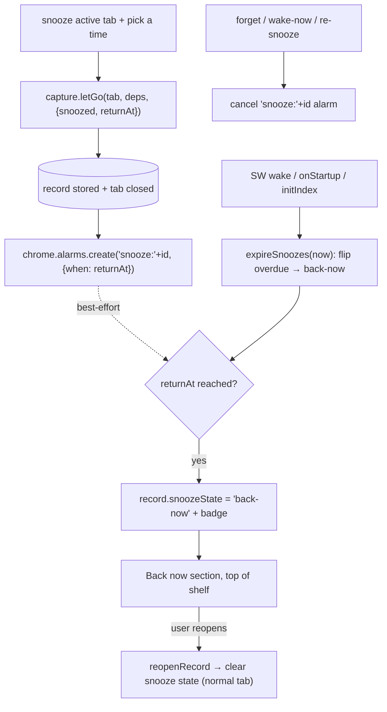
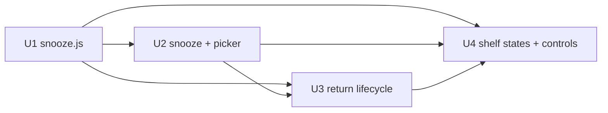

# feat: ypuf slice 3 — snooze

## Summary

Snooze is auto-let-go's voluntary twin, built almost entirely from slices 1–2.
The user snoozes the active tab; ypuf captures it through slice 1's `letGo`
(the `recordExtra` param stamps the snooze state into the single pre-close
write), closes it, and schedules a return. At the chosen time the item surfaces
in a pinned **"Back now"** section at the top of the shelf with a gentle badge —
**no tab auto-reopens**. The return's guarantee is an **overdue sweep on every
SW wake/startup** (per-item `chrome.alarms` are best-effort timeliness only), so
nothing is lost even if Chrome drops every alarm. One new pure module
(`extension/lib/snooze.js`) holds the preset→time math and overdue logic;
everything else extends existing seams.

---

## Problem Frame

A1 (tab-drowning knowledge worker) keeps tabs open as open loops because "later"
has no home — leaving them open is the clutter ypuf cures, bookmarking is the
junk drawer they never revisit. Snooze gives "later" a guaranteed return: let
the tab go *and* get it back at a chosen time. It ships after auto-let-go
because it reuses the same capture-then-close path and the same recall net
(origin Problem Frame; CONTEXT §5c).

---

## Requirements

Traces to origin `docs/brainstorms/2026-06-15-ypuf-slice3-snooze-requirements.md`.

**Reuse/foundation** — R1 (reuse capture path + shelf + store/index + alarms),
R2 (same privacy gate as let-go). **Trigger** — R3 (snooze the active tab via
hotkey/popup → duration picker), R4 (presets incl. "when I'm back"), R5 (live-tab
only). **While snoozed** — R6 ("snoozed until X" shelf state, recallable), R7
(wake-now + re-snooze). **Return** — R8 (surfaces in a "back now" state at the
top of the shelf + badge, no auto-open), R9 (guaranteed-but-late across
restarts), R10 (never an auto-let-go candidate). **Privacy/calm** — R11
(local-only; forget cancels the return), R12 (feels like setting down, not
scheduling).

**Origin actors:** A1. **Flows:** F1 (snooze a tab), F2 (a snooze returns).
**Acceptance examples:** AE1 (R3/R4/R6), AE2 (R8), AE3 (R9), AE4 (R7), AE5 (R2),
AE6 (R10).

---

## Scope Boundaries

- **Snoozing an existing shelf item**, **recurring snooze**, **snooze
  analytics**, **auto-reopening the tab**, and a **separate snoozed surface** —
  all out (origin Scope Boundaries). Snooze is a live-tab action; the return
  goes to the existing shelf.

### Deferred to Follow-Up Work

- Exact default clock times for relative presets and the picker's visual design
  (land during implementation/dogfooding, not as separate units).

---

## Context & Research

### Relevant Code and Patterns

- `extension/lib/capture.js` — `letGo(tab, deps, recordExtra)` is reused
  verbatim. `recordExtra` is `Object.assign`-stamped into the single pre-close
  `store.put` for both content and floor records (proven by `tests/capture.test.js`),
  so snooze passes `{snoozed:true, returnAt, snoozeState:'snoozed'}`. The
  pending-undo + in-flight guard stay (a snooze is undoable in the grace window
  like any let-go).
- `extension/background.js` — extends these seams: the `chrome.alarms` wiring
  (slice 2's single periodic `auto-sweep` alarm; snooze adds **per-item
  `when`-alarms named `snooze:<recordId>`** and a sibling branch in the existing
  `onAlarm` listener — not a replacement); `initIndex` (already runs
  `expirePending`/`sweepPendingForget` on every wake — the natural home for an
  `expireSnoozes(now)` overdue sweep); `runtime.onStartup` (re-arm pending
  snooze alarms); `reopenRecord` (the return-reopen path; its protection logic
  is gated on `rec.autoClosed`, so a snoozed reopen correctly doesn't protect a
  domain); the badge (`bumpBadge`/`seenBadge`/`BADGE_KEY`); `listRecent` (extend
  the projection); the message router (`respond` wrapper + `sender.id` guard);
  `buildDeps` (unchanged); the forget/purge paths (`forgetPage`/`forgetDomain`/
  `purgeDomainStores` — must cancel the per-item alarm).
- `extension/lib/store.js` — additive record fields are safe (no `VERSION` bump,
  no migration; `normalize` only requires `timestamp`, proven by `store.test.js`).
  Snooze state lives on the record; `getAll().filter` finds pending/overdue
  snoozes (consistent with how `autoClosedRecords`/retention scan). **`listRecent`
  sorts by capture `timestamp` desc** — a tab snoozed days ago sorts *low*, so
  R8 needs an explicit top-section rule, not just a marker (see U4).
- `extension/lib/exclusion.js` — the gate, reused verbatim inside `letGo` (R2).
- `extension/lib/eligibility.js` — unchanged; R10 holds structurally (a snoozed
  tab is closed, so the auto-sweep's `chrome.tabs.query` never sees it).
- `extension/popup/popup.{js,html}` — the shelf `render()` + the `autoClosed`→
  "let go for you" marker pattern is the template for "snoozed until X"/"back
  now"; the let-go button + `chrome.commands` hint show the trigger pattern.
- `extension/manifest.json` — `alarms` permission already present (slice 2). May
  add a 4th `commands` entry for a snooze hotkey (within Chrome's suggested-key
  cap of 4).
- `tests/` — `node --test` + `fake-indexeddb` + DI chrome stubs (`tests/capture.test.js`
  `makeDeps` is the template).

### Institutional Learnings

`docs/solutions/architecture-patterns/mv3-local-content-indexing-extension-2026-06-14.md`
— carry forward: **serialize writes** if any shared storage key is mutated by
multiple listeners (snooze mostly avoids this by keeping schedule state on
per-record IndexedDB writes, which are atomic per record); **capture-before-close
ordering** (free via `letGo`); **gate-then-extract** (free via `letGo`);
**always-answer-async-onMessage**; **cross-store purge** (forget must cancel the
alarm); **DI pure module** for the scheduling/overdue math. The learnings doc
notes the **alarms-re-arm-on-startup + overdue-sweep** pattern is *new ground*
(not yet documented) — a `/ce-compound` candidate after this slice lands.

### External References

None needed — slice 2 already did the `chrome.alarms` research and the wiring
exists in the codebase. Scheduling is reuse-plus-extend, not new API territory.

---

## Key Technical Decisions

- **Schedule state lives on the captured record; the overdue sweep is the
  guarantee.** Snooze adds `snoozed`/`returnAt`/`snoozeState` as additive record
  fields (no migration). Per-item `when`-alarms give timely returns while Chrome
  runs, but the *guarantee* (R9) is `expireSnoozes(now)` running on every SW
  wake/startup (alongside the existing `expirePending`): any record with
  `returnAt <= now` flips to "back now." So even if Chrome drops every alarm
  (the slice-2 `persistAcrossSessions` lesson), nothing is lost. Alarms are an
  optimization, not the safety mechanism.
- **"Back now" is a pinned top section, not a sort tweak.** Because `listRecent`
  orders by capture time, returned snoozes get their own section above the
  recently-let-go list — clearest match to "surfaces at the top" (R8) and avoids
  a fragile synthetic sort key.
- **"When I'm back" = an `untilStartup` flag, resolved only at startup.** That
  preset sets `{untilStartup:true}` (no `returnAt`, no alarm) rather than a
  numeric sentinel — a `0` would be `<= now` and the ~5-min wake sweep would flip
  it immediately, breaking "until I'm back at my desk." Only the
  `runtime.onStartup` handler resolves `untilStartup` records; the wake-path
  overdue sweep touches numeric `returnAt` only.
- **A single guarded flip owns the badge.** Because the per-item alarm and the
  wake-path sweep can both target one record, the `snoozed→back-now` flip is an
  idempotent guarded transition (badge only when the state actually changes,
  through the serialized badge step) so a coincident alarm+sweep can't
  double-count.
- **Reuse `letGo` for capture; reuse `reopenRecord` for the return-open.** Snooze
  = "let go, but bring it back." After a back-now item is reopened from the
  shelf, its snooze state is cleared (it becomes a normal fresh tab — R10).
- **Scheduling math is a pure DI module** (`lib/snooze.js`): preset→`returnAt`,
  `isDue`, `pendingSnoozes`/`dueSnoozes`, state transitions — unit-tested with
  injected `now`, no chrome stub.
- **Badge:** a returned snooze contributes to the existing action badge (the
  count of shelf items wanting a look); the exact share-vs-separate visual is a
  follow-up detail, the mechanism (`bumpBadge`/`seenBadge`) is reused.

---

## Open Questions

### Resolved During Planning

- **Schedule storage:** on the record (additive), not a separate store.
- **Return guarantee:** overdue sweep on wake/startup; alarms best-effort.
- **Ordering:** "Back now" group pinned above "Snoozed" above the let-go list;
  conditionally rendered (absent when empty).
- **"When I'm back":** an `untilStartup` flag resolved only on `onStartup`.
- **Row interaction:** back-now rows click-to-open (+clear state); snoozed rows
  are not click-to-open (wake / later controls; recall-via-search stays open).
- **Trigger/picker:** a secondary "Snooze" button beside "Let go" reveals an
  inline preset panel; one picker reused inline for re-snooze.
- **Flip ownership:** a single idempotent guarded transition owns the badge.

### Deferred to Implementation

- Exact default clock times for the relative presets, and the precise picker/
  label styling (pixels, not behavior).
- Whether the snooze "back now" count shares the existing action badge or is
  visually separated (mechanism reused either way).
- The in-running-Chrome cadence: rely on per-item `when`-alarms plus the
  existing 5-min `auto-sweep` wake to also run `expireSnoozes`, or add a small
  periodic snooze alarm (the overdue sweep makes this non-load-bearing).
- Whether `custom` date-time ships in v1's picker or is deferred to keep the
  first picker minimal (the preset path is the calm default).

---

## Output Structure

    extension/
      lib/snooze.js          # U1 pure scheduling + overdue + state logic
      background.js           # MODIFY: handleSnooze, onAlarm snooze branch,
                             #         expireSnoozes (initIndex), rearm on startup,
                             #         wake/re-snooze handlers, forget-cancel, listRecent
      popup/popup.html|js    # MODIFY: snooze trigger + duration picker, "Back now"
                             #         section, "snoozed until X" state, wake/re-snooze
      manifest.json          # MODIFY (optional): a 4th `snooze` command
    tests/
      snooze.test.js         # U1 pure-logic tests
      capture.test.js        # MODIFY: snooze recordExtra coverage (if separable)
      MANUAL-DOGFOOD.md      # MODIFY: slice-3 snooze checklist

---

## High-Level Technical Design

> *Directional guidance for review, not implementation specification.*

---

## Implementation Units

### U1. `lib/snooze.js` — scheduling, overdue, and state logic (pure)

**Goal:** A pure, DI'd module that turns a preset into a `returnAt`, decides what
is due, and owns the snooze state transitions — unit-testable with an injected
`now`.

**Requirements:** R4, R6, R8, R9

**Dependencies:** None

**Files:**
- Create: `extension/lib/snooze.js`, `tests/snooze.test.js`

**Approach:**
- `resolve(preset, now, custom?)` → a **schedule** that is *either* `{returnAt:<ts>}`
  (clock presets: `later-today`, `this-evening`, `tomorrow-morning`,
  `this-weekend`, `next-week`, `custom`=a passed timestamp) *or*
  `{untilStartup:true}` for `when-im-back`. **No numeric sentinel** — using `0`
  would be `<= now` and get swept on the next wake; the startup case is a
  distinct flag the clock path never matches. Default clock times for the
  relative presets are constants (tunable; deferred values).
- `dueSnoozes(records, now)` → records where `snoozeState === 'snoozed'` **and a
  numeric `returnAt <= now`** (untilStartup records are excluded by construction
  — they carry no `returnAt`). `pendingClock(records)` → still-snoozed records
  with a future numeric `returnAt` (the re-arm set). `pendingStartup(records)` →
  still-snoozed `untilStartup` records (the startup-resolve set).
- `mark(record, state)` → returns the record with `snoozeState` set
  (`'snoozed'|'back-now'|null`); null also clears `returnAt`/`untilStartup`
  (reopen → normal tab).
- UMD wrapper + `module.exports`/`self.ypuf.snooze`, mirroring `signal.js`.

**Execution note:** Test-first for the preset/overdue/state math.

**Patterns to follow:** `extension/lib/signal.js` / `extension/lib/tabstate.js`
(pure DI module shape, injected `now`).

**Test scenarios:**
- Covers AE1. Happy path: `resolve('tomorrow-morning', now)` → `{returnAt}` at
  the next morning; `resolve('custom', now, ts)` → `{returnAt: ts}`.
- Edge: `resolve('when-im-back', now)` → `{untilStartup:true}` (no `returnAt`).
- Covers AE3. Edge: `dueSnoozes(records, now)` returns exactly the still-snoozed
  records with numeric `returnAt <= now`, and **never an `untilStartup` record**
  (so "when I'm back" is not flipped by a wake-path sweep).
- Edge: `pendingStartup` returns the `untilStartup` snoozed records; `pendingClock`
  returns future-`returnAt` snoozed records (the re-arm set).
- Edge: `mark(record,'back-now')` / `mark(record,null)` set/clear state and (for
  null) clear `returnAt`/`untilStartup` without touching other fields.
- Edge: a record that is not `snoozed` is never in `dueSnoozes`.

**Verification:** Preset, overdue, and state logic are correct from an injected
`now` alone; no chrome dependency.

---

### U2. Snooze a tab + duration picker (flow F1)

**Goal:** The user snoozes the active tab via a trigger + duration picker; the
tab is captured (reusing `letGo`), closed, and a return is scheduled.

**Requirements:** R1, R2, R3, R4, R5, R12

**Dependencies:** U1

**Files:**
- Modify: `extension/background.js` (`handleSnooze`, schedule the alarm, message
  branch), `extension/popup/popup.html` + `extension/popup/popup.js` (trigger +
  picker), `extension/manifest.json` (optional `snooze` command)
- Test: `tests/capture.test.js` (snooze `recordExtra` coverage) + dogfood

**Approach:**
- `handleSnooze(preset, custom?)` mirrors `handleLetGo`: `initIndex()` →
  `getActiveTab()` → resolve the schedule (`snooze.resolve`) → `capture.letGo(
  projectedTab, await buildDeps(), {snoozed:true, snoozeState:'snoozed',
  ...schedule})` where `schedule` is `{returnAt}` or `{untilStartup:true}`. On
  `res.record`: `persistSnapshot()` and, **only for a clock schedule**,
  `chrome.alarms.create('snooze:'+res.record.id, { when: returnAt })` (an
  `untilStartup` record creates no alarm — it's caught by the startup path). No
  notification (calm). Reuses the gate (R2) and undo (free).
- **Popup trigger + picker (concrete IA):** a secondary **"Snooze"** button sits
  next to the existing "Let go" button (let-go stays the primary action; snooze
  is the quieter sibling). Clicking it reveals an **inline panel** directly below
  the buttons (not a modal) listing the presets as a vertical stack of text
  buttons (matching the shelf's `.link`-button style); a final **"Custom…"** row
  reveals a native `datetime-local` input. Choosing a preset sends `{type:'snooze',
  preset, custom?}` then `window.close()`. An optional `snooze` command opens the
  popup to this panel (it does not snooze with a silent default — the user always
  picks a time).
- The message router gets a `respond`-wrapped `snooze` branch (it confirms
  scheduling so the popup can close cleanly).

**Patterns to follow:** `handleLetGo` + the let-go button wiring + the
`respond` message pattern in `background.js`/`popup.js`.

**Test scenarios:**
- Covers AE1. Integration (DI): `letGo` with `{snoozed:true, returnAt}` persists
  a record carrying those fields (both content and floor records).
- Covers AE5. Edge: snoozing a blocklisted tab stores title+URL only (gate
  inherited) and still records `returnAt`.
- Edge: the "when I'm back" preset records the sentinel and creates no alarm.
- Test expectation: the picker UI + `chrome.alarms.create` are dogfood-verified
  (not node-testable); the capture/record-shape half is unit-tested.

**Verification:** Snoozing a tab closes it, stores a recallable record marked
snoozed-until-X, and schedules (or sentinels) the return.

---

### U3. Return lifecycle: alarm branch, overdue sweep, startup re-arm, forget-cancel (flow F2)

**Goal:** A snoozed item reliably becomes "back now" at its time — and never
gets lost across SW termination or browser restart.

**Requirements:** R4 (the `untilStartup` return), R8, R9, R10, R11

**Dependencies:** U1, U2

**Files:**
- Modify: `extension/background.js` (extend `onAlarm`, add `expireSnoozes` to
  `initIndex`, re-arm on `onStartup`, badge, cancel-on-forget)
- Test: `tests/snooze.test.js` (the pure due/overdue logic) + dogfood

- **One owner for flip+badge (idempotent).** Both the `snooze:`-alarm and the
  wake-path sweep can target the same record, so the flip is a guarded
  transition: load the record, and only if it is still `snoozeState==='snoozed'`,
  `snooze.mark(record,'back-now')` + `store.put` + `bumpBadge(1)`; if it is
  already `back-now`, no-op (no second badge). The badge increment goes through
  a single serialized step (the slice-2 `mutate`-chain shape) since `bumpBadge`
  is a read-modify-write on the shared `BADGE_KEY`.
- Extend the existing `onAlarm` listener with a sibling branch: `if
  (alarm.name.startsWith('snooze:'))` → run the guarded flip above +
  `persistSnapshot`.
- **The guarantee (wake path):** add `expireSnoozes(now)` to `initIndex` (which
  already runs on every SW wake alongside `expirePending`/`sweepPendingForget`):
  apply the guarded flip to every `dueSnoozes(store.getAll(), now)` record
  (numeric `returnAt <= now` only — `untilStartup` records are **not** touched
  here).
- **Startup path (`runtime.onStartup`):** (a) `rearmSnoozeAlarms()` recreates a
  `when`-alarm for each `pendingClock` record (persistAcrossSessions is
  unreliable — slice-2 lesson); (b) run `expireSnoozes(now)` so clock snoozes due
  while Chrome was off surface as overdue; (c) flip every `pendingStartup`
  (`untilStartup`) record to back-now — this is the **only** place "when I'm
  back" resolves.
- **Forget cancels the return — collect IDs before deletion.** `forgetPage`
  already has the id → `chrome.alarms.clear('snooze:'+id)`. For the domain paths,
  `forgetDomain`/`blocklistAdd` must gather the affected ids via
  `store.getByDomain(host)` **before** `privacy.forgetDomain` deletes the records
  (which returns only a count), then clear each `snooze:'+id` alarm; wire this
  through `purgeDomainStores` so both paths are covered. Otherwise a domain-
  forgotten snooze leaves a dangling alarm that later fires on a deleted record.
- R10 is structural (a snoozed item is closed → never in `chrome.tabs.query`);
  no eligibility change.

**Patterns to follow:** the slice-2 `rearmAutoAlarm`/`onStartup`/`initIndex`
wake pattern; `purgeDomainStores` cross-store purge.

**Test scenarios:**
- Covers AE3. Unit: given records with past/future numeric `returnAt` and an
  `untilStartup` record, `dueSnoozes(records, now)` selects exactly the past
  numeric ones and never the `untilStartup` one.
- Edge (idempotent): applying the flip twice to one record badges once — a record
  already `back-now` is a no-op (guards the onAlarm/sweep double-fire).
- Edge: `pendingStartup` selects the `untilStartup` records that the startup path
  flips; a wake-path `expireSnoozes` leaves them snoozed.
- Integration (dogfood): a clock snooze due while Chrome was closed is "back now"
  on next startup (R9); a "when I'm back" snooze surfaces on next startup, not on
  a mid-session wake.
- Integration (dogfood): forgetting a snoozed item — single (`forgetPage`) and
  whole-domain (`forgetDomain`/block) — cancels its `snooze:` alarm (no late
  return on a deleted record).

**Verification:** Every snooze returns — on time if Chrome is running, on next
wake/startup if not — and a forgotten snooze never returns.

---

### U4. Shelf states, "Back now" section, and wake-now / re-snooze (R6, R7, R8)

**Goal:** The shelf shows snoozed and returned items clearly, floats returns to
the top, and lets the user wake early, re-snooze, or reopen.

**Requirements:** R6, R7, R8, R10, R12

**Dependencies:** U1, U2, U3

**Files:**
- Modify: `extension/background.js` (extend `listRecent` projection;
  `snooze-wake`/`snooze-resnooze` handlers; clear state on reopen), `extension/popup/popup.html`
  + `extension/popup/popup.js` (Back-now section, snoozed marker, controls),
  `extension/style.css`
- Test: dogfood + any separable pure-logic coverage

- Extend `listRecent`'s projection with `snoozeState`, `returnAt`, and
  `untilStartup`. The popup splits the list into three groups in order:
  **"Back now"** (records `snoozeState === 'back-now'`), then **"Snoozed"**
  (records `snoozeState === 'snoozed'`), then the normal recently-let-go list.
- **"Back now" is conditionally rendered** — the section (heading + rows) is in
  the DOM only when ≥1 back-now record exists; otherwise it's absent entirely
  (no empty heading occupying the most-common state), mirroring the existing
  `empty.hidden` pattern. The recently-let-go list stays unlabeled as today; the
  existing shelf empty-state still fires only when *all* groups are empty.
- **Row interaction model (the load-bearing decision):**
  - A **back-now** row is click-to-open (like a returned item): click →
    `reopenRecord` → the SW clears its snooze state (`snooze.mark(record, null)`,
    cancel any alarm) so it's a normal fresh tab (R10). Label: if overdue, a
    `back · due <timeAgo>` meta tag (relative, via `timeAgo`); else `back now`.
  - A **snoozed** row is **not** click-to-open (prevents accidental early opens);
    it shows a `snoozed until <X>` meta tag (`X` = the `returnAt` via the time
    helpers, or **"next time you're back"** for an `untilStartup` record — never
    a raw `0`/flag) plus two quiet `.link` controls: **wake** (`snooze-wake` →
    the guarded flip to back-now now + cancel alarm) and **later** (`snooze-resnooze`).
    The item stays **recallable via the command-bar/search** the whole time (R6)
    — recall, not the shelf-row click, is the "open it while snoozed" path.
- **Re-snooze reuses the same preset list inline:** picking **later** replaces
  that row's controls with the U2 preset buttons; choosing one sends
  `snooze-resnooze` with the new schedule (re-arming/replacing the alarm; a
  `custom` re-snooze is allowed but optional to ship). One picker
  implementation, two mount points.
- All page-derived strings via `textContent`; calm, quiet styling (R12) — the
  group labels are subdued meta-text, not bold dividers.

**Patterns to follow:** the `render()` + `autoClosed` marker + `mkBtn` control
pattern + the section-toggle pattern in `popup.js`.

**Test scenarios:**
- Covers AE2. Integration (dogfood): a returned snooze appears in the "Back now"
  section at the top with a badge; clicking it restores the page and clears its
  snooze state. With zero back-now items the section is absent (no empty heading).
- Covers AE4. Integration (dogfood): **wake** flips a snoozed item to back-now
  immediately; **later** reveals the inline preset list and sets a new return
  time, re-arming the alarm.
- Edge (dogfood): a snoozed row is not opened by a body click (only wake/later/
  recall act); it is still found by command-bar recall search (R6).
- Edge (dogfood): an overdue back-now row shows `back · due <relative>`; an
  `untilStartup` snoozed row shows "next time you're back" (never a raw flag).
- Test expectation: rendering/controls are dogfood-verified; any extracted
  grouping/label helper is unit-tested.

**Verification:** Snoozed and returned items are visually distinct, returns sit
at the top, and wake/re-snooze/reopen all behave.

---

## System-Wide Impact

- **Interaction graph:** the SW gains a `handleSnooze`, an `onAlarm` snooze
  branch, an `expireSnoozes` step in `initIndex`, a startup re-arm, and
  wake/re-snooze handlers; the popup gains a picker + the Back-now section. The
  capture path, recall reopen, store/index, gate, and auto-let-go sweep are
  reused unchanged.
- **Error propagation:** capture-before-close + undo are inherited from `letGo`;
  the overdue sweep makes a dropped alarm non-fatal; async message branches
  answer or surface errors; forget cancels alarms (no dangling returns).
- **State lifecycle:** snooze state is on the record (IndexedDB, atomic
  per-record write — no shared-key race); the guarantee is timestamp-derived
  (overdue sweep), not an in-memory timer.
- **Unchanged invariants:** slices 1–2 behavior (capture/recall/signal/auto-let-go),
  the manual let-go contract, and privacy are untouched; R10 holds structurally.

---

## Risks & Dependencies

| Risk | Mitigation |
|------|------------|
| A snooze silently never returns | Overdue sweep on every wake/startup is the guarantee; alarms are best-effort only |
| `chrome.alarms` lost across restart | Re-arm on `onStartup` + overdue sweep catches anything due while Chrome was off |
| A returned snooze sorts low in the shelf | Pinned "Back now" top section (not a synthetic sort key) |
| Dangling alarm after forget | `forgetPage`/`forgetDomain`/`purgeDomainStores` clear `snooze:<id>` |
| Schedule-vs-record drift | Schedule lives *on* the record (one source of truth); alarm only nudges |
| Snoozed item wrongly auto-closed | Structural — a snoozed tab is closed, so the sweep never sees it (R10/AE6) |

**Dependencies:** slices 1 + 2 (shipped) — capture path, shelf, store/index,
recall reopen, the `chrome.alarms`/badge/startup-rearm wiring. No new permissions
(`alarms` already present); an optional 4th `commands` entry.

---

## Documentation / Operational Notes

- Local-only; validation is the `tests/MANUAL-DOGFOOD.md` slice-3 checklist
  (snooze a tab; verify it's "snoozed until X" + recallable; verify return on
  time and after a simulated restart; wake-now/re-snooze; forget cancels it).
- The **alarms-re-arm-on-startup + overdue-sweep** mechanism is new ground (not
  in the learnings doc) — a `/ce-compound` candidate after this lands.

---

## Sources & References

- **Origin:** [docs/brainstorms/2026-06-15-ypuf-slice3-snooze-requirements.md](docs/brainstorms/2026-06-15-ypuf-slice3-snooze-requirements.md)
- Learnings: `docs/solutions/architecture-patterns/mv3-local-content-indexing-extension-2026-06-14.md`
- Prior slices: `docs/plans/2026-06-14-001-feat-ypuf-slice1-recall-shelf-plan.md`,
  `docs/plans/2026-06-15-001-feat-ypuf-slice2-auto-let-go-plan.md`
