# feat: Semantic Recall (recall by meaning) — fork C, static embeddings

## Summary

Add opt-in *recall by meaning* to ypuf as new pure-tested libs (a static-embedding core
and a two-axis hybrid retrieval+blend over the Recall v2 ranker) plus a thin opt-in shell
(one-time model fetch + integrity-verify + cache, per-page vectors in IndexedDB, a calm
Settings toggle, one idempotent purge). Pure-JS static embeddings (`potion-base-8M`) — **no
build step, no WASM, no offscreen doc, no CSP change**. A go/no-go quality spike (U1) with a
pre-registered threshold gates the whole slice so a too-weak model can't ship a doomed
experiment.

---

## Problem Frame

ypuf's recall (live as v1.1.0) is keyword search over a local content index — blind when you
only remember a page's *gist*. CONTEXT.md §3/§12 names this gist-recall layer as the product's
moat and sanctions *local semantic recall* (keyword-first, optional small embedding model),
distinct from the §9-parked embedding clustering and the §6-rejected generative LLM. The
honest complication (see origin doc): there is **no observed felt demand** — so this is a
moat/delight bet, built deliberately cheap, reversible, and experiment-framed.

Web research (2026) resolved the build-step fork the brainstorm left open: static-embedding
models (Model2Vec / potion) reduce inference to *tokenize → token-vector lookup → mean-pool →
L2-normalize* — pure array math, no neural forward pass, no WASM, no ONNX. The safetensors
matrix parses in ~20 lines of vanilla JS; a WordPiece tokenizer is pure JS. The asset is
*data*, not code, so MV3 allows fetching it from our own GitHub Release; a pinned SHA-256
check guards integrity; Cache Storage holds the blob. **No offscreen doc and no CSP change**
are required for the pure-JS path. (see origin: `docs/brainstorms/2026-06-23-ypuf-semantic-recall-requirements.md`)

---

## Requirements

Traces to the origin requirements doc (R1–R9).

**Opt-in, privacy, reversibility**
- R1. Settings toggle "Recall by meaning," off by default (origin R1). — U6
- R2. On opt-in, fetch the static-embedding asset once, size disclosed first; nothing fetched unless opted in (origin R2). — U4, U6
- R3. Recall always works without semantic; toggle off / asset absent / any failure → keyword fallback, no error/degrade (origin R3). — U5
- R4. 100% on-device — no page content, embedding, or query ever transmitted; the asset fetch is the only network call (origin R4). — U4, U7
- R8. Cleanly removable — toggle off deletes vectors + asset, leaving no residue (origin R8). — U3, U4, U6, U7
- R9. Calm opt-in: quiet toggle, disclosed one-time download with progress + graceful failure, no cockpit/nagging (origin R9). — U6

**The cheap experiment (fork C)**
- R5. Pure-JS static embeddings — no build step, WASM, CSP change, neural inference, or battery cost; accept the retrieval-quality gap (origin R5). — U1, U2
- R6. Blend meaning-matches into the existing recall ranking — one calm ranked list, not a separate mode (origin R6). — U5
- R7. One small per-page vector from the already-indexed readable text (no new capture/permission), stored alongside the content index within retention (origin R7). — U3

---

## Key Technical Decisions

- **Model: `potion-base-8M` (~30MB, 256-dim) over `potion-base-2M` (~8MB).** The 2M model is
  weak enough on retrieval (~56–60% of MiniLM; a Mar-2026 real-world test found potion models
  *missing* relevant results) that it risks failing the experiment for the wrong reason. 8M
  (~68% of MiniLM) gives a fair test at an acceptable one-time opt-in download. `potion-retrieval-32M`
  (best, ~82%) is ~120MB — rejected, breaks "calm." *(user-confirmed)*
- **Go/no-go quality spike with a PRE-REGISTERED threshold (U1).** Before any machinery, embed a
  sample of real let-go pages and judge gist-query precision against a numeric bar fixed *before*
  the data is seen. If it doesn't clear the bar, the slice **stops and escalates** (fork A or
  shelve) — never ship a doomed experiment. *(user-confirmed; threshold added per review)*
- **Keep/kill: dogfooding + a time-boxed default-to-kill rule.** ypuf is 100% local with zero
  telemetry, so "is it used?" is the owner's felt judgment. Because quiet non-use is the
  *predicted* outcome and felt judgment can't observe a non-event, the rule resolves silence to a
  decision: if after a fixed window (≈4 weeks) the owner has not consciously caught a page keyword
  missed, **remove it**. (A local-only "semantic-only hits" counter stays deferred; the time-box
  makes the experiment decidable without it.) *(dogfooding user-confirmed; decidability rule added per review)*
- **Semantic is a primary retrieval axis, NOT a lift on text score.** Recall-by-meaning must
  surface zero-keyword pages, but the shipped `rank.rerank` buries any `textScore=0` row below its
  relevance FLOOR — so the existing text-FLOOR/MAX_LIFT model **cannot** accommodate semantic
  candidates and must be reworked into a two-axis score where `max(text-relevance, semantic-similarity)`
  drives candidacy and the bound operates on the combined primary score. (This is a redesign of a
  tested correctness core, not an "extend"; see U5.) *(corrected per review)*
- **Asset delivery:** fetch from our own GitHub Release → SHA-256 verify against a pinned hex
  constant **on download AND on every cold-start cache read** (re-verify guards cache tampering) →
  **Cache Storage** for the blob; per-page vectors in IndexedDB beside the content index, each
  **tagged with the model-version** so a model bump invalidates + re-backfills rather than blending
  stale vectors. Download runs from the new-tab **page**, not the SW. *(re-verify + version tag added per review)*
- **Manifest delta is minimal and NARROW:** add `unlimitedStorage` + a **new narrow** optional
  host pattern for the GitHub-release host (and its redirect host) — **never `<all_urls>`**, which
  is already load-bearing (its removal disables auto-let-go via `background.js` `permissions.onRemoved`).
  Opt-out revokes only the narrow pattern, leaving auto-let-go untouched. **No CSP change** (the
  custom CSP declares no `connect-src`/`default-src`, so a host permission alone authorizes the
  fetch — verified against the shipped RSS-panel fetch) and **no `wasm-unsafe-eval`.** CWS: declare
  *no remote code* (weights are data). *(narrow-pattern collision corrected per review)*
- **Tokenizer: a pure-JS WordPiece (hand-rolled, ~100 lines) is the DEFAULT.** The
  `@huggingface/tokenizers` npm package ships a Rust/WASM build and would violate R5 — do not reach
  for it. A genuinely pure-JS WordPiece over potion's flat `vocab`/`tokenizer.json` is the path;
  only a verified-pure-JS port may substitute. *(WASM hazard corrected per review)*
- **No offscreen doc.** Pure-JS lookup+pool needs no DOM/WASM/WebGPU; the existing offscreen
  document stays audio-only.

---

## High-Level Technical Design

*Directional guidance for review, not implementation specification.*

```mermaid
flowchart TD
  Q[recall query] --> G{semantic on AND model ready?}
  G -- no --> KW[keyword hits MiniSearch]
  G -- yes --> EMB[embed query -> vector]
  EMB --> SEM[cosine top-K over per-page vector store]
  EMB --> KW
  SEM --> U[union + dedup by canonical key &#40;recallmerge&#41;]
  KW --> U
  U --> BL[two-axis blend: max&#40;text relevance, semantic similarity&#41; + intent, bounded]
  KW -- semantic off path --> RANK[existing rerank]
  BL --> RANK
  RANK --> R[one calm ranked list]
```

Enabling (one-time): toggle on → disclose ~30MB → fetch from GitHub Release → SHA-256 verify →
Cache Storage → **batched, resumable** backfill-embed of the existing index → ready. Disabling:
delete vectors + cached asset + opt-in flag, revoke the narrow host permission → keyword-only.

---

## Implementation Units

### U1. Quality validation spike (go/no-go gate, pre-registered threshold)

**Goal:** De-risk the slice before any machinery — prove (or disprove), against a bar fixed in
advance, that `potion-base-8M` static embeddings surface the right let-go pages from gist queries
on *real* ypuf content.
**Requirements:** Gates all (R1–R9); validates R5's pure-JS approach and informs the keep/kill success
criterion (a Success Criterion, not an R-ID).
**Dependencies:** none.
**Files:** a dev-only harness outside `extension/` (e.g. `tools/semantic-spike/`) — **not shipped**.
Consumes the real `potion-base-8M` `model.safetensors` + `tokenizer.json`.
**Approach:** in pure JS (node), parse the safetensors matrix, tokenize (pure-JS WordPiece),
mean-pool + normalize; embed a fixed corpus of real page texts. **Pre-register before embedding:**
the corpus size N, the gist-query set (authored to mirror real recall-failure scenarios, *before*
seeing which pages embed well, to avoid confirmation bias), the definition of "correct target," and
a numeric pass bar — e.g. *go iff semantic surfaces the intended page in top-K for ≥X% of queries
AND recovers ≥Y queries where keyword put the target outside top-K*. Reuse the real `rank.js` two-axis
path (U5 design) so the spike also validates that zero-keyword pages survive ranking, not just raw
cosine.
**Execution note:** Spike. The numeric pass bar (X, Y) and the gist-query set **must be committed to
git** (in the spike harness or a dated note) BEFORE the corpus is embedded — a pre-registered threshold
only de-risks if the numbers are fixed before the data is seen. Output = a documented go/no-go decision
+ the proven pure-JS embed code that seeds U2. No-go → STOP the slice, escalate to fork A or shelve. A
"borderline" band → a dogfood-only mini-rollout before committing U2–U7.
**Patterns to follow:** the research note's load→tokenize→pool→normalize; the real `rank.js`.
**Test scenarios:** `Test expectation: none -- dev spike; the embedding code it validates is promoted and unit-tested in U2.`
**Verification:** a documented go/no-go against the pre-registered bar, with evidence (which queries
surfaced which pages, including the keyword-miss recoveries).

### U2. Static-embedding core (pure-JS lib)

**Goal:** The pure, tested embedding core: `embed(text) -> normalized Float32 vector` and
`cosine(a, b)`, given the model matrix + tokenizer.
**Requirements:** R5.
**Dependencies:** U1 (proven approach).
**Files:** `extension/lib/embed.js` (new), `extension/vendor/wordpiece.js` (vendored pure-JS
WordPiece — NOT `@huggingface/tokenizers`, which ships WASM), `tests/embed.test.js` (new).
**Approach:** parse the safetensors header → `Float32Array` view over the embedding matrix;
tokenize via the pure-JS WordPiece (over potion's flat vocab); sum token rows / count; L2-normalize;
cosine. Pure — no `chrome.*`, no network. Smoke-test the tokenizer against potion's real
`tokenizer.json`.
**Patterns to follow:** `extension/lib/rank.js`, `extension/lib/recallmerge.js` (IIFE +
`module.exports` + `root.ypuf`, dep resolution `self.ypuf.X || require`); Pattern 18.
**Test scenarios:**
- Known text + tiny fixture matrix → expected pooled, unit-length vector (happy path).
- Empty / whitespace-only text → a safe zero/neutral vector, no NaN.
- Out-of-vocab / unknown tokens handled without throwing.
- `cosine` of identical vectors = 1, orthogonal = 0, within tolerance.
- Output vector is unit length; input arrays not mutated (purity).
- Tokenizer smoke: a known sentence → expected token ids against potion's `tokenizer.json`.
**Verification:** `npm test` green; `embed()` deterministic + unit-length; matches U1's outputs.

### U3. Per-page vector store + embedding lifecycle (resumable backfill)

**Goal:** One model-version-tagged vector per canonical page, embedded incrementally at capture and
via a batched/resumable backfill on opt-in; aged out with its record at every deletion site; purged
on opt-out.
**Requirements:** R7, R8.
**Dependencies:** U2.
**Files:** `extension/lib/vectorstore.js` (new), `extension/lib/store.js` (IDB version bump + a
canonical-key index + an `onEvict(records)` hook on `prune`/`quotaPrune`), `extension/lib/blocklist.js`
(drop vectors in `retroactivePurge` + the forget/domain-purge paths), `extension/background.js`
(embed-on-capture, the resumable backfill job + cursor), `tests/vectorstore.test.js` (new).
**Approach:** A new IndexedDB object store keyed by the canonical origin+path key (Pattern 9/29),
holding `{ key, vector (Float32), modelVersion }`. **Adding the store needs a `store.js` VERSION bump
+ `onupgradeneeded` migration** (currently VERSION 1, single store). **The same migration adds a
canonical-key (origin+path) index on the RECORD store** — the store keys records by `id` and indexes
only host/lastAccessed/byteSize/timestamp, so without it U5's cosine results (keyed by canonical key)
have no cheap key→record lookup (only an O(N) `getAll` scan). **The id↔key join is explicit, both
directions:** deletion resolves the key from the record's url *before* deleting (record→key); U5
resolves a vector's key to its record via the new index (key→record). Wire vector deletion into the
chokepoints: extend `store.prune`/`quotaPrune` with an `onEvict(records)` callback that drops matching
vectors (the callback receives the record objects already in scope — the byte-budget branch's `evict`
array must carry records, not bare ids; covers the LRU/byte-budget eviction inside `put()` under quota
pressure, not just the cold-start sweep), and into `capture.collapsePrior`, the `blocklist.js`
forget/domain-purge paths, **AND `blocklist.js`'s `retroactivePurge` (the blocklist-*add* path, which
*downgrades records in place* — `content:''` — rather than deleting; the vector embedded from that
now-scrubbed content MUST be dropped too, or a blocklisted page stays cosine-searchable — a privacy
regression).** **Backfill (opt-in):** a batched, resumable, idempotent job in the SW with a persisted
cursor (Pattern 10) so an SW kill resumes rather than restarts; it **re-checks each record still exists
at embed time** (not a stale pre-snapshot id list) so a concurrently-forgotten page can't get a
re-created vector; partial coverage degrades to keyword for not-yet-embedded pages (never "broken").
**Embed-on-capture** (the `letGo` path) is naturally incremental. Purge clears the whole vector store.
**Patterns to follow:** `extension/lib/store.js`, `extension/lib/capture.js` collapse-by-canonical-key,
Pattern 10 (resumable persisted claim), Pattern 13 (forget spans stores), Pattern 32 (retention).
**Test scenarios:**
- Store + get a vector by canonical key; query/hash variants collapse to one vector (newest wins).
- Backfill over N records → N vectors; an interrupted backfill resumes from its cursor without
  re-embedding completed pages and leaves no page without a vector.
- Forget a page → its vector is gone (Covers AE4).
- An LRU/byte-budget eviction inside `put()` drops the evicted records' vectors (no orphans).
- Blocklisting a domain (`retroactivePurge`) drops the vectors for its now-scrubbed pages — no searchable residue.
- A vector's canonical key resolves to its store record via the new index (key→record, O(1)).
- Purge → vector store empty (Covers AE4).
- A vector tagged with an old model version is invalidated on version mismatch (re-backfill path).
- Vector persists across a simulated SW restart.
**Verification:** vectors persisted + retrievable by canonical key + version-tagged; forget/prune/
quota-evict/purge leave no orphan vectors; backfill is resumable; the IDB migration is non-destructive.

### U4. Model asset lifecycle (opt-in download, verify-on-read, cache, purge, manifest delta)

**Goal:** Fetch the model once on opt-in (from the new-tab page) over a *narrow* host permission,
verify integrity on download and on every cache read, cache it, signal ready, re-embed any pages let
go while it was absent, and delete cleanly — eviction-safe.
**Requirements:** R2, R4, R8.
**Dependencies:** U2.
**Files:** `extension/lib/modelasset.js` (new — pure hash/verify core + thin fetch/cache shell),
`extension/newtab/newtab.js` (download trigger + progress from the page), **`extension/manifest.json`
(`unlimitedStorage` + the NARROW optional host pattern — this delta lives in U4, the unit that needs
it, not U7)**, `tests/modelasset.test.js` (new — the pure core).
**Approach:** `fetch(releaseUrl)` → `ArrayBuffer` → `crypto.subtle.digest('SHA-256', buf)` →
constant-time compare to a pinned hex constant → `cache.put`. **Re-verify the same hash on every
cold-start cache read** before handing bytes to the embed core (guards cache tampering; ~20ms for
30MB). A cache miss falls back to keyword + offers re-download; **after a re-download, a delta-backfill
re-embeds pages let go during the absent window** (track an embed-watermark so the gap can't leave
pages permanently keyword-only while semantic reads "on"). The **narrow** host permission (the
release host AND its `objects.githubusercontent.com` redirect target — confirmed by tracing the
redirect) is requested inside the opt-in user gesture (`chrome.permissions.request`) and revoked on
opt-out — **never `<all_urls>`**. Download runs in the **page**, not the SW — and the fetch uses default `redirect:'follow'`; it must NOT
copy the RSS broker's `redirect:'error'` / SSRF `sourceurl` validation (which would hard-fail GitHub's
302 to `objects.githubusercontent.com`). The **model-version tag** stored on each vector (U3) is derived
from the *verified asset hash of the loaded bytes* — not a separate source-side constant — so a vector
can never be tagged a version it wasn't actually embedded with (closes the bump-window race). The pinned
hash + URL are updated atomically per model release (a `release.sh` / checklist step verifies the bytes
before tagging).
**Patterns to follow:** Pattern 18 (pure verify core), Pattern 10 (resumable claim), the shipped
RSS-panel in-gesture `grantThenAdd` permission flow in `extension/newtab/newtab.js`, and the
reversible-purge discipline in `extension/lib/blocklist.js` (exports `ypuf.privacy`) — there is no
`lib/privacy.js` file.
**Test scenarios (pure core):**
- SHA-256 hex of known bytes = expected hex (happy path).
- Tampered/mismatched bytes → verify rejects; nothing cached; a tampered *cached* blob is rejected on
  read (re-verify path).
- Hex encoding zero-pads; constant-time compare correct.
- `Test expectation` for the fetch/cache shell: none -- thin impure glue, exercised via manual dogfood + the pure-core tests.
**Verification:** opt-in downloads → verifies → caches; tampered bytes rejected on download AND read;
cold start reads + re-verifies from cache; delta-backfill covers the absent window; purge removes the
bucket; revoke touches only the narrow pattern (auto-let-go unaffected).

### U5. Hybrid retrieval + two-axis ranking blend

**Goal:** When semantic is on, surface meaning-matches (including zero-keyword pages) and blend them
into the one ranked recall list; keyword-only and byte-for-byte unchanged when off.
**Requirements:** R3, R6.
**Dependencies:** U2, U3.
**Files:** `extension/lib/rank.js` (rework the FLOOR/MAX_LIFT model into a two-axis score),
`extension/lib/recallrank.js` (resolve semantic candidates → records → synthetic hits, union with
keyword hits), `extension/background.js` (`getRecallResults`: gate on semantic-enabled + model-ready,
embed the query, cosine top-K, merge), `tests/` additions to the rank/recallrank suites.
**Approach:** embed the query → cosine top-K (K bounded; one cosine pass over the vector store) →
**resolve each semantic candidate's canonical key back to its store record via the new U3 canonical-key
index** (key→record, O(1) — not a `getAll` scan), then build a finished ROW like `recallrank.openRow`
(synthesize a complete row appended to `rows` *before* `recallmerge.merge`, NOT a `hits[]` entry — a
semantic candidate has no MiniSearch hit), carrying a fixed kind, the cosine on a new `semantic` field,
and **empty `matchTerms`** so `excerptAround` returns `''` rather than throwing. Dedup against the
keyword rows by canonical key via `recallmerge.merge` (field-level merge keeps the keyword twin's
terms/excerpt). **Rework `rank.rerank`/`blend` to two axes:** thread a per-row `semantic` value through
`blend`; both axes share a comparable **0..1 basis** (cosine is already 0..1; normalize the text score
against its run-max), and candidacy/`topScore` operate on `primary = max(textNorm, semantic)` — NOT a
lift on `textScore` (a zero-keyword page has `textScore=0` and the current text-only FLOOR/`topScore`
would bury it, *and* an all-semantic result set makes text `topScore=0` so `FLOOR*topScore=0` admits
everything — both are why `topScore` must be taken over `primary`, not text). The combined primary is
bounded so neither an exact keyword match nor a strong semantic match buries the other; the intent
signal stays a bounded lift on top. **Cap the final list AFTER the union+blend** (not the pre-union
keyword `slice(20)`) so a strong semantic-only match isn't dropped. Keyword path byte-for-byte unchanged when semantic is off / model absent / query
embed fails (R3). The raw query string crosses the page↔SW boundary (local IPC) and is embedded in the
SW; nothing is serialized to any network channel.
**Execution note:** the two-axis blend is a pure tested scoring core; tune weights via dogfood.
**Patterns to follow:** Pattern 28 (bounded blend — now two-axis), Pattern 29 (cross-source dedup),
`recallrank.openRow` (the synthetic non-index-row precedent), `rank.js` + `recallrank.js`.
**Test scenarios:**
- Covers AE2. A record with `textScore=0` and high cosine **survives rerank and lands in the top
  results** (the headline guard — assert before tuning weights).
- Covers AE1. Semantic off → ranking identical to today's keyword order (byte-for-byte).
- Bounded two-axis: a strong semantic match can't bury an exact keyword match, and vice versa (assert
  a concrete numeric bound).
- Union dedup: a page matched by both keyword and semantic appears once (canonical key), keeping the
  keyword excerpt/terms.
- A semantic candidate whose record was evicted (`store.get` → null) is dropped without error.
- Covers AE3. Model absent / query-embed failure → keyword fallback, no error.
**Verification:** gist queries surface zero-keyword meaning-matches in the top results; keyword path
unchanged when off; two-axis blend bounded; all fallbacks graceful.

### U6. Settings toggle + calm opt-in / download UX (all interaction states)

**Goal:** A quiet "Recall by meaning" toggle (off by default) with every interaction state specified:
disclosure, in-progress, ready, failure, eviction-redownload, and a confirmed off.
**Requirements:** R1, R2, R8, R9.
**Dependencies:** U3, U4, U5.
**Files:** `extension/newtab/newtab.js` (a settings group + the states below), `extension/newtab/newtab.css`,
`extension/background.js` (config flag + enable/disable/status messages).
**Approach:** a settings group mirroring `buildBoardGroup`/`buildAutoGroup`. Enumerate the states
(no state left for the implementer to invent):
- **Disclosure (committed copy):** "Recall by meaning downloads a ~30MB model once from ypuf's GitHub
  — nothing from your pages or searches ever leaves your device. Keyword recall keeps working while it
  loads." Actions: `Enable` / `Not now` (`Not now` leaves the toggle off).
- **Permission denied** (`chrome.permissions.request` returns false): toggle returns to off, a one-line
  "Couldn't get permission — keyword recall still works."
- **In-progress:** toggle visually locked (not re-tappable); a quiet progress affordance replaces the
  card; closing the NTP aborts (the resumable claim re-offers on next open).
- **Failure** (download or SHA-256 mismatch): toggle returns to off, "Couldn't download the model —
  keyword recall still works. Try again?" with one retry action.
- **Ready + backfill:** mark enabled after verify; the backfill runs as a continuous quiet "preparing…"
  state through download→verify→backfill (no unexplained post-download stall), disappearing when done;
  recall stays keyword+partial-semantic meanwhile.
- **Evicted / needs re-download:** when on but the model is absent on cold start, the settings group
  shows "Model was cleared by the browser — keyword recall is active. Re-download?" with one action.
- **Off (confirmed):** an inline confirm ("Turning this off removes the downloaded model and all
  meaning-vectors. Keyword recall continues.") before the destructive purge (U3+U4) + narrow-permission
  revoke — not a modal, but not a silent accidental flip either.
- **Reduced motion:** the progress affordance fills instantly, the card appears without a fade, the
  toggle uses a color change only — no entrance animation.
- **"By meaning" marker:** none this slice (invisible blend, consistent with R6/calm); leave a row-level
  data hook so a later follow-up can add a marker without DOM restructuring.
The "what's indexed" / forget surface notes that forgetting/purging includes semantic vectors. Text-only
for page-derived parts (§7).
**Patterns to follow:** `buildBoardGroup`/`buildAutoGroup`; the v1.1.0 settings-legend group; Pattern
17/20 (seq-token + state reset) for the async download→ready transition.
**Test scenarios:** primarily impure settings DOM atop the U3/U4/U5 cores — assert config default is
off; the enable→disclosure→download→ready→backfill and the confirmed disable→purge transitions call the
right cores; failure/eviction states render their copy + retry action; disclosure copy is the committed
string. `Test expectation: behavioral UI verified via manual dogfood (tests/MANUAL-DOGFOOD.md) atop the U3/U4/U5 unit cores.`
**Verification:** off by default; every state above is reachable and calm; an accidental toggle-off
can't silently destroy the model; reduced-motion honored.

### U7. Privacy disclosure, reversibility, and release wiring

**Goal:** Honest privacy disclosure (amending the now-inaccurate page section), forget/CWS
consistency, and the model-release checklist. (The manifest delta moved to U4.)
**Requirements:** R4, R8.
**Dependencies:** U6.
**Files:** `site/privacy.html` (amend the "Network requests" section, not just append a note),
`docs/store/permissions-and-data.md` (if present — the CWS answers), `extension/background.js` / popup
(forget covers vectors), `release.sh` / `docs/store/` (the hash-rotation checklist step), `NOTICE.md`
(the potion model's MIT notice for the re-hosted asset).
**Approach:** the privacy page's "Network requests" section currently says ypuf "makes zero network
requests" — amend it: an "Optional: recall by meaning" paragraph that distinguishes the model download
from panel fetches (an internal ypuf asset, occurs only on explicit opt-in, downloads only model
weights), and **scope the absolute claim** — "your page content and searches never leave your device"
(GitHub sees the file request like any download). CWS: declare *no remote code* (weights are data).
Add a release-checklist step: the pinned hash + URL update atomically and `sha256sum` is verified before
tagging; a model bump invalidates + re-backfills vectors (the version tag from U3). Add the model's MIT
notice to `NOTICE.md`.
**Patterns to follow:** Pattern 13 (forget spans stores); the v1.1.0 "About this website" privacy-page
tone; the existing `release.sh` flow.
**Test scenarios:** `Test expectation: none -- docs/disclosure/release-process changes; behavior is covered by U3/U4/U6.`
**Verification:** the privacy page's "Network requests" section is accurate post-slice and the claim is
scoped to content/queries; forget/purge leaves no residue; the release process pins + rotates the hash;
CWS answers consistent.

---

## Scope Boundaries

- **The neural-model upgrade (fork A)** — `bge-small-en-v1.5` + a build step + transformers.js/
  ONNX-WASM + a `wasm-unsafe-eval` CSP. **Deferred, not rejected**: the graduation target if the
  experiment earns it. Model/runtime research is already done (origin doc's research note).
- **Generative summaries / any generative LLM** (§6) — out; this is retrieval, not generation.
- **"More like this" lateral recall** — parked with the Recall v2 slice.
- **Embedding-based session clustering** (§9) — a different parked feature.
- **Multilingual / non-English** — the static model is English-first.
- **Chunking long articles into multiple vectors, and cross-device vector sync** — one vector per
  page, local only. (The U1 corpus must include long, multi-topic pages so per-page mean-pooling's
  gist-dilution weakness is measured, not hidden.)

### Deferred to Follow-Up Work

- A local-only "semantic-only hits" usage counter (the time-boxed default-to-kill rule covers
  decidability without it; add it only if the silent case proves genuinely ambiguous in dogfooding).
- A visible "by meaning" marker on semantic-surfaced rows (U6 leaves a DOM hook; not built by default).
- int8-quantized vectors to fit a tighter §11 budget (Float32 ships first; if quantized later, re-run
  the U1 quality check since cosine results shift).

---

## Risks & Mitigation

- **Opt-out revoke kills auto-let-go.** `<all_urls>` removal disables the hero feature via
  `permissions.onRemoved`. → Use a NEW narrow host pattern, never `<all_urls>`; revoke only it; a
  dogfood/test asserts toggling semantic off does not disable auto-let-go.
- **Zero-keyword pages buried by the rank FLOOR.** → Two-axis rerank with `max(text, semantic)`
  candidacy; a top-of-suite test asserts a `textScore=0`/high-cosine page survives.
- **Orphan vectors from id-keyed eviction.** → `onEvict` hook on `prune`/`quotaPrune` (incl. the
  in-`put()` quota path); a read-side null-record guard; tests for LRU-evict + forget + purge.
- **The experiment fails for the wrong reason (model too weak / biased gate).** → U1 pre-registered
  threshold on real content, gist queries authored before seeing embeddings; chose 8M over 2M.
- **Backfill / model-absent gap leaves silent holes.** → resumable batched backfill (cursor); a
  delta-backfill after re-download; partial coverage degrades to keyword.
- **Stale vectors after a model bump.** → model-version tag on each vector; invalidate + re-backfill on
  mismatch; atomic hash/URL rotation in the release checklist.
- **Cache eviction drops the model.** → re-derivable; cache-miss → keyword + a surfaced re-download
  offer; `unlimitedStorage`; the IDB index stays source of truth.
- **Privacy perception (a download on a "100% local" tool).** → the only network call is the
  user-initiated, disclosed, one-time fetch; claim scoped to "content/queries never leave the device";
  the privacy-page "Network requests" section amended; fully reversible.
- **CWS review friction.** → no remote *code*, no `wasm-unsafe-eval`, no broad install host permission.
- **SW death mid-download.** → download runs in the page; a persisted in-progress claim re-offers.

---

## System-Wide Impact

- **Recall path (`getRecallResults`)** gains a gated semantic branch + a two-axis rerank; the keyword
  path is byte-for-byte unchanged when semantic is off (the default for all current users).
- **`rank.js`** — the tested FLOOR/MAX_LIFT core is reworked to two axes (correctness-critical; guarded
  by the AE2 top-of-suite test).
- **`store.js`** — an IDB VERSION bump + migration for the vector store, and an `onEvict` hook on prune.
- **Capture (`letGo`)** gains an embed-on-capture step when semantic is on (cheap, static).
- **Storage:** a new per-page vector (256 floats ≈ 1 KB/page) + a ~30MB Cache Storage blob — both
  opt-in, both purged on opt-out, both within retention.
- **Manifest:** `unlimitedStorage` + a narrow optional host pattern (U4); no CSP change; `<all_urls>`
  untouched.
- **No new always-on cost:** off-by-default users get no download, no battery, no slower recall.

---

## Dependencies / Assumptions

- **No observed felt demand** (origin assumption) — the slice is a reversible experiment; keep/kill is
  owner dogfooding + the time-boxed default-to-kill rule.
- Static-embedding retrieval quality is below a neural model (8M ≈ 68% of MiniLM); the U1 gate confirms
  it clears the pre-registered bar on real content before shipping.
- Depends on the existing local content index (per-page readable text) as the embedding input — no new
  capture, no new install-time permission.
- The tokenizer is a vendored pure-JS WordPiece (NOT `@huggingface/tokenizers`, which ships WASM).
- The model asset (`potion-base-8M`, ~30MB, MIT) is re-hosted as an immutable ypuf GitHub Release asset
  with a pinned SHA-256; the release host's redirect target must be covered by the narrow host pattern.
- `fake-indexeddb` round-trips Float32 typed arrays under structured clone — the U3 test author confirms
  this early (a known occasional shim gap).

---

## Outstanding Questions

### Deferred to Implementation

- [Affects U4][Technical] The exact GitHub Release asset URL + the redirect host (`objects.githubusercontent.com`
  or similar) the narrow `optional_host_permissions` pattern must cover, confirmed by tracing the redirect;
  the pinned SHA-256 constant (set at release time). *(The narrowness vs. redirect-coverage trade-off
  determines whether re-hosting on a ypuf-controlled CDN is worth it.)*
- [Affects U5][Technical] The exact two-axis blend formula + weights and K for the cosine top-K — a pure
  tested core, tuned via dogfood; confirm the per-query cosine scan stays within the "faster than
  re-googling" latency bar at a few-thousand-vector index.
- [Affects U3][Technical] Vector precision in IDB (Float32 first; int8 only if the §11 budget demands,
  with a U1 re-check); confirm per-page averaging suffices (no chunking) for typical article length.
- [Affects U2][Technical] Whether a small verified-pure-JS WordPiece port handles potion's `tokenizer.json`,
  else hand-roll (~100 lines).
